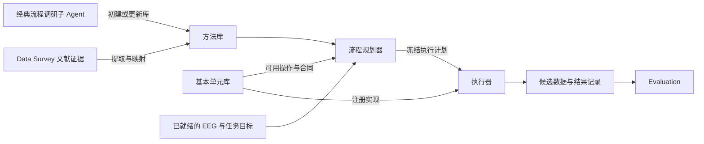

# Data Preprocess 实现方案

版本：设计基线 v1.3；日期：2026-09-06，已同步飞书新版单元表。本文按“职责 → 组成 → 执行 → 开发”组织。2026-09-07 已按 A+B 范围落地首版；实际操作支持范围、启动及验收见 [实现与运行说明](data-preprocessing-implementation.md)。下文保留设计目标，未启用操作按 C 阶段继续接入。

## 1. 职责与输入输出

**Data Preprocess 对信息调研充分、且符合标准目录结构的 EEG 数据，生成并执行预处理流程，输出供 Evaluation 比较的候选结果。**

| 边界 | 内容 |
|---|---|
| 接收数据 | Data Collection 的标准化 EEG、结构核验结果和筛选后记录清单 |
| 接收信息 | Data Survey 的数据事实、任务/事件含义、已有处理历史及文献证据 |
| 接收目标 | 连续数据或 Epoch 等目标阶段、分析约束、指定方法和资源预算 |
| 交付结果 | 各候选方法的数据、实际参数、模型/处理决定、事件映射、变化统计与执行状态 |

入口核验上游产物指向同一数据版本，并检查当前方法需要的信息。数据整理与全局纳入范围由 Collection 负责；质量比较和 best output 由 Evaluation 负责；面向用户的报告和最终交付由后续模块负责。

首版范围建议为离线头皮 EEG，支持验收数据实际采用的标准目录和文件格式。开发使用符合相同合同的测试样本；生产入口要求真实上游证据。

## 2. 内部只设四个核心部分

| 部分 | 唯一职责 | 主要内容 |
|---|---|---|
| 基本单元库 | 定义并实现可调用的处理操作 | 表格定义、代码适配、参数和输入输出校验 |
| 方法库 | 保存可复用的方法及其证据 | 经典流程、Survey 文献方法、步骤、适用条件、版本和验证 |
| 流程规划器 | 将方法落实为当前数据可执行的计划 | 参数绑定、顺序/依赖检查、适用性、去重和初筛 |
| 执行器 | 执行计划并提交可核查的结果 | 调用单元、保存产物、记录进度、失败与恢复 |

DataPreprocessingAgent 保留为现有对话入口，调用这四部分；存储、状态和 API 是它们共用的工程支持。

### 2.1 基本单元库

以 2026-09-06 读取的 [飞书表格快照](E:/work/BrainAgent/docs/sources/preprocessing-units-feishu-2026-09-06.csv) 为准：50 个唯一 ID，全部附代码。旧版的 43 项及“23 项附代码、20 项待接入”已由新版取代；源表验证声明与本项目集成验证分别记录。

一项 UnitSpec 包含三个字段组：**source** 保存原表定义、验证声明与哈希，**implementation** 按 op/profile 保存代码入口、参数/状态合同和依赖，**validation** 保存本项目逐操作验证状态与证据。它们分别管理版本，但首版放在一份单元记录中。

接入顺序为：保留原 ID → 按原函数/op 包装 → 校验输入和参数 → 执行 → 校验并保存输出 → 注册可用实现。原表代码进入版本控制后调用，不在运行时从 CSV 动态执行。

例如 EEG-ICA 仍是一个单元，当前包含 ica_fit、eog_assess、ecg_assess、muscle_assess、ica_apply，并支持 FastICA/Picard/Infomax。注册和验证要精确到实际算法及操作；旧 ID 的合并、50 项限制与验收见 [逐单元附件](E:/work/BrainAgent/docs/preprocessing-unit-implementation-plan.md)。

### 2.2 方法库：两种来源，共用一个结构

| 来源 | 谁提供 | 如何入库 |
|---|---|---|
| 预定义经典方法 | 一个 ClassicPipelineSurveyAgent | 调研原论文、作者代码和明确版本，提出步骤、参数、适用条件与映射草案 |
| 文献方法 | 第一个 Agent 的 SurveyLiteratureBundle | Preprocess 提取步骤与参数证据，映射单元；缺内容回交 Survey 补充 |

经典调研子 Agent 在初建库或明确更新时调用。处理新数据集时读取固定库版本。已有代表方法的调研及覆盖差异见 [经典流程附件](E:/work/BrainAgent/docs/preprocessing-classic-methods-survey.md)。

两种来源统一保存为 **MethodSpec**：id/version、来源证据、适用条件、步骤与参数规则、单元映射、偏离说明、验证证据。原来的 MethodCard 和 Recipe 分别成为其中的 evidence 与 recipe 字段，避免重复维护方法身份和参数。

方法发布状态仅保留 draft / validated / retired；详细取证、映射或环境缺口放在 checks 中。发布为 validated 需固定版本、完成准确映射，并通过代表输入的实际验证。方法在当前数据上是否适用由规划器另行判断。

草案在静态检查通过后可用验证模式运行固定代表样本，验证结果通过才发布；该模式仍只调用已注册实现，结果标为验证运行。正式数据任务使用已验证方法及其声明的参数范围。

MNE 相关方法以具体流水线/项目模板及配置命名。源表不能准确表达的完整方法，可提出正式的原生复合单元扩展；映射差异详见经典流程附件。

## 3. 一次运行只有三个步骤

### 第一步：生成并筛选执行计划

规划器加载上游输入和候选 MethodSpec，按记录的采样率、通道/参考、任务等条件绑定参数，形成具体步骤。数据条件不同的记录可使用不同配置实例。

参数保留来源值、覆盖理由与实际值；关键未知项生成缺口。严格复现时的参数修改形成 adapted 变体。LLM 可以提取和提出步骤，程序负责检查注册能力、依赖和数据状态。

初筛暂用以下草案，均输出明确理由：

| 检查 | 处理 |
|---|---|
| 方法是否适用、步骤/参数/实现是否完整 | 满足才入选；全局输入缺失阻塞任务，单一方法缺失只阻塞该候选 |
| 解析后的实现、顺序、参数、拟合范围和输出是否相同 | 严格重复只运行一次，保留全部来源 |
| 预算内是否覆盖不同处理机制 | 优先保留能增加方法差异的候选，其余标记延期；用户指定的方法保留其选择意图 |

指定全选与预算冲突时列出冲突，不静默减少执行范围。

结果为 selected / duplicate / deferred / blocked，并保存适用记录与原因。依据和证据限制放在 [接口与规则附件](E:/work/BrainAgent/docs/data-preprocessing-v2-scope-and-methods.md)。这些仍是探索性规则；执行后的质量指标进入 Evaluation。

最后保存不可变 **ExecutionPlan**：输入快照、方法/单元版本、记录配置、步骤依赖、参数及来源、拟合范围、筛选决定、环境和输出要求。关键项齐备才可执行；修改配置生成新计划。

### 第二步：执行计划

按“一个候选方法 × 一条逻辑记录”执行。逻辑记录可能包含多个伴随文件，读取时保持文件组完整。首版逐记录串行；步骤按显式依赖运行，拟合副本通过命名输入输出引用表达。

每个步骤统一执行：输入校验 → 加载模型/决定 → 调用注册单元 → 输出校验 → 保存运行记录。单元负责数值操作；执行器负责对象身份、文件保存和任务状态。算法内部依赖数据才能确定的阈值等，在运行时再次校验并保存。

必须保留的正确性约束：

- 源数据与输出分离，使用工作副本，并核验输入文件组哈希。
- 检测候选与最终应用决定分开；决定绑定当前数据版本，模型绑定实际拟合集合。
- 数据状态包含单位、参考、通道、秩和时间框架；变化须被后续步骤识别。
- 按 op/profile 表达允许的 NaN 传播、修复后 bads 清除、辅助通道保留及来源带宽例外；不得沿用旧单元的统一限制。
- 原事件、Epoch 和 Trial 保持可追溯关系；删除或修复保存原因，统计有明确分母。
- 按方法与单元要求保存全部必需产物；通过验证后才提交成功。

附加产物的掩码、分数单位、允许缺失值和模型兼容性等规则放在逐单元附件。正式流水线执行前，对已声明人工复核的方法检查本轮执行模式；首版全自动范围暂不纳入这类分支。

### 第三步：汇总并交接

提交 **RunResult**：计划引用、逐方法/记录状态、产物索引、处理变化及失败原因。EEG、模型和大数组以文件保存，Agent/数据库传递小型摘要与引用。

对外固定三类结果：

| 结果 | 用途 |
|---|---|
| 处理数据 | 每个实际执行候选的连续数据或 Epoch |
| 复现与解释材料 | 实际参数、版本、模型、分数/掩码、决定、事件/Trial 映射、日志 |
| 执行汇总 | 覆盖记录、保留/剔除变化、失败与不适用项、校验和产物索引 |

一种候选失败不阻止其他独立候选。所有选定且适用的任务及必需产物完成才是 completed；有可用结果但部分失败为 partial；未完成项始终可见。Evaluation 按结果引用读取，明确可比较的记录/Trial 范围。

## 4. 在现有架构中如何实现

首版 [DataPreprocessingAgent](E:/work/BrainAgent/backend/app/agents/data_preprocessing/agent.py) 已替换模拟结果，复用 [AgentTask](E:/work/BrainAgent/backend/app/runtime/context.py) 的 inputs 与 [AgentResult](E:/work/BrainAgent/backend/app/runtime/result.py) 的产物外壳，接入计划、提交、状态与文献方法处理。

建议新增一个 preprocessing 目录，先用少量文件实现：

    backend/app/preprocessing/
      schemas.py        # 四个核心对象及上游输入协议
      units/            # 源表单元的定义、适配器、注册与验证
      methods.py        # 统一方法库、经典调研接入、Survey 方法提取
      planner.py        # 参数绑定、依赖检查与初筛
      runner.py         # 单方法、单记录执行
      storage.py        # 文件产物、校验和结果索引
      service.py        # Agent/API 共用的计划与任务入口
      worker.py         # 单个独立计算进程

其中 UnitSpec、MethodSpec、ExecutionPlan、RunResult 是四个核心对象。DataState、模型、决定和事件映射作为执行上下文/产物结构保存，不各自扩展为独立服务。

现有代码只改必要连接点：

| 位置 | 修改 |
|---|---|
| DataPreprocessingAgent | 接收输入引用，调用 plan / submit / status，返回计划或任务引用 |
| DataSurveyAgent 与检索输出保存 | 发布完整数据/文献证据包；摘要与原文证据分开保存 |
| 总编排 | 将结构化 inputs 传给 AgentTask；接收补充请求；区分任务已提交与结果可消费 |
| 数据库与结果状态 | 持久化计划、任务/记录状态及结果引用；提交成功不能显示为处理完成 |
| 现有对话界面 | 展示计划、进度、失败和结果入口；首版用状态查询更新 |

API 保留计划、提交、状态、取消/重跑和结果查询；详细路由可在实现时确定。所有资源引用继续受现有用户归属与路径检查约束。

计算使用单独 Worker，API/对话不等待全部计算结束。首版同一记录只允许一个活动执行，重复提交返回已有任务；取消在步骤边界处理。Worker 中断后将未完成记录标为 interrupted，恢复时核验固定输入/计划，只重跑未完成记录并生成新 attempt。已验证记录可复用。

## 5. 开发只分三个阶段

| 阶段 | 范围 | 完成标准 |
|---|---|---|
| A：一条真实流程 | 登记 50 项定义与逐操作支持状态；固定上游接口；复用目标流程所需代码完成规划、执行、保存 | 一份完整验收清单可处理；源数据不变；输出可重读；每条记录有状态和事件对应 |
| B：方法接入与比较准备 | 接通经典调研子 Agent 和 Survey 文献入口；至少两条有实质区别的候选；初筛、模型/决定绑定和基本恢复 | 两种来源都能进入统一 MethodSpec；缺失项可回传；候选结果、来源、变化和失败可交接 |
| C：按需补能力 | 其余已有操作的依赖、适配和集成验证，以及目标完整方法仍缺少的连接或能力 | 每个新增方法所需步骤完整、版本固定并通过针对性验证 |

**首版以 A+B 为目标，不要求先接入全部 50 项及其全部变体。** 当前重点是已有实现的复用、依赖与证据核验和集成验证。未接入项保留状态；两种候选是开发验收目标，实际数量按请求确定。经典调研可在 A 阶段准备材料，B 阶段验证入库与调用。

首版保留输入/版本核验、源数据保护、模型与事件追溯、单记录失败隔离、持久化与基本恢复。以下能力按需求扩展：跨方法共享缓存、逐步骤断点恢复、通用复杂图调度、多 Worker/分布式运行、实时事件流、专门的方法管理界面、人工审核工作流。

验收使用合成信号和固定代表数据，检查单元正确性及流程完整性；再用完整的小型记录清单检查多记录执行。质量优劣与神经信号保留的比较属于 Evaluation。

## 6. 文档分工

| 文档 | 只回答什么 |
|---|---|
| 本文 | 模块如何组成、如何运行、先实现什么 |
| [逐单元附件](E:/work/BrainAgent/docs/preprocessing-unit-implementation-plan.md) | 当前 50 项操作覆盖、旧 ID 迁移及接入验证 |
| [经典流程附件](E:/work/BrainAgent/docs/preprocessing-classic-methods-survey.md) | 方法依据、版本、适用范围与单元覆盖差异 |
| [接口与规则附件](E:/work/BrainAgent/docs/data-preprocessing-v2-scope-and-methods.md) | 上游字段、证据补充、结果合同和初筛文献依据 |
| [简短介绍](E:/work/BrainAgent/docs/data-preprocessing-v2-brief.md) | 可直接用于模块说明的短文 |

架构、核心命名和实施阶段以本文为准；附件展开相应细节，不再维护另一套组件或阶段。
