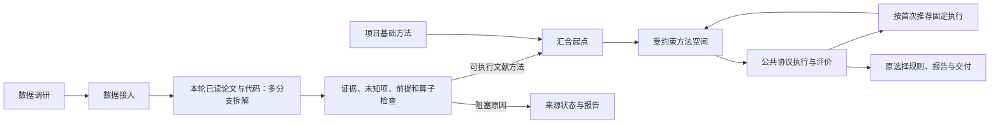

# 本轮文献进入预处理方法空间
> 2026-09-13 范围更新：保留首次推荐，移除后续模型自主调整。当前规则见[首次推荐与固定执行](fixed-initial-recommendation.md)。本文中的历史自主调整验收不再作为当前目标。

主工作流顺序为：数据调研 → 数据接入 → 文献方法拆解 → 基础与文献方法汇合 → 受约束方法空间 → 首次推荐冻结、固定执行与评价 → 选择、报告与交付。文献拆解沿用 `data_preprocessing` 阶段，在创建搜索前完成；没有增加新的顶层 Agent 或改变评价协议。



## 来源与拆解

`workflows/literature_methods.py` 从本工作流的 `survey/literature.json` 选择 included、非 abstract 的来源，并从 `survey/sources.json` 读取保存正文。论文与代码都参与，重复分类下的同一来源只提取一次。定位证据包括已纳入 finding 及已读正文的连续片段，保留字符偏移、原来源版本/哈希和截断状态，不把部分正文升级为完整全文。

模型返回 `LiteratureExtraction`，每个来源可包含多条 `MethodBranch`。每条分支保留：分析名称、分支与共享证据编号、前置筛查、完整方法草案、步骤和参数来源。分类器、特征提取及无关分析列入 excluded_branches。模型看到目标任务、事件、采样率、通道配置及拟合区间，以及实际启用的操作合同。

`parameter_sources.origin` 区分 `paper`、`target_binding`、`engineering`、`unresolved`。未知科学参数保留 `$profile.*` 并阻塞。系统拒绝跨声明分支的参数证据引用；自然语言证据是否充分支持某个参数仍取决于提取质量，不能把索引有效性解释为独立文献复核。

新提取的 `checks` 必须为空；问题用 `issues.severity` 区分 blocking、validation、limitation。历史 MethodSpec 的旧 checks 继续作为阻塞项，避免自动推测旧记录的严重程度。无法实现的步骤和前置条件不以近似操作替代。

原始模型响应、输入、逐分支方法与内容寻址的注册引用保存在：

```text
preprocessing/literature-methods/
  manifest.json
  <source-key>/input.json
  <source-key>/extraction.json
  <source-key>/resolved-extraction.json
  <source-key>/recovery.json
  <source-key>/<branch-id>.json
preprocessing/decisions.json
```

manifest 绑定文献、输入和实现指纹；重复进入阶段复用相同快照。来源或数据变化要求新工作流，不能混合旧提取与新输入。失败来源保存具体原因，其他来源继续处理；没有有效文献方法时基础方法仍可运行。

工作目录中现有的有界修复逻辑继续保留：可在预算内读取来源中实际给出的链接、重新提取，或者保留阻塞。补读和修订另存，不覆盖初始提取；页面分别链接模型原始提取和修订后草案。本地真实实例的初始提取不应当作这条新增修复路径的真实模型验证。

## 方法空间与可执行性

`search/literature_space.py` 汇合现有项目基础方法与注册文献方法。基础方法保留原先的数值配方和科学先验，只补充明确的项目方法身份。本轮文献保留工作流、纳入条目、来源、分支、版本及 method_ref。

来源步骤首先匹配现有精确算子语义；不能匹配时，仅能从 `preprocessing.units.OPERATIONS` 中已启用的操作创建受限定义。目录中的源码存在不代表操作已启用。额外算子在有效方法需要时才进入空间；参数域来自引擎边界或明确标记的工程范围，不声称论文推荐最优值。

所有候选通过现有 `compile_steps` 按选中记录检查：参数、输入类型、数据/模型/决定引用、拟合范围、参考状态、采样率和频带约束。文献候选还须符合公共通道、采样率和时间窗。连续准备方法可增加明确记录的公共重采样/分段适配器；已声明的来源时间窗冲突会阻塞，不静默覆盖。

工作目录的后续适配逻辑会为符合条件的最终切窗冲突另建 `literature_adaptation` 分支，记录原窗口、目标窗口及 `fidelity=engineering_adaptation`；原来源分支仍保持阻塞。该路径已通过当前合同测试，不能与固定实例的原始配方混为一谈。

相同规范化配方合并执行身份，同时合并所有方法谱系、证据与步骤追踪。去重不丢弃第二篇论文的来源关系。这里不宣称能识别所有数学等价的不同算法表达。

## 搜索与调度

模型在任何候选执行前，从基础与本轮文献完整方法中首次推荐一次顺序。推荐冻结后先执行固定参考，再依序评价推荐方法；目录、顺序和参数不得根据反馈改变。候选可以因资源或执行条件失败，但失败不生成替代配方。文献参与仍按实际执行记录报告。


编辑后既检查空间规则，又按公共数据合同编译，之后才预留数值实验。谱系校验可从父配方重新应用编辑，发现登记内容被篡改时拒绝执行。随机、枚举等既有有限对照邻域仍保留原比较边界，不能称为穷尽任意组合。

## 展示与解释

搜索页“方法来源与执行状态”和 HTML 搜索报告展示基础与文献来源、适配、阻塞和固定执行状态。搜索产物补充：

| 产物 | 用途 |
|---|---|
| `method-extraction.json`、`literature-methods/` | 原始读取到分支提取的记录 |
| `source-methods/` | 注册前后保持一致的源方法草案 |
| `source-evidence/` | 以内容引用和文件哈希双重校验的正文对象，供独立数值执行库导入 |
| `method-intake.json`、`method-compilation/` | 可执行性检查及预编译结果 |
| `space.json`、`registry.json` | 固定完整方法目录及来源 |
| `method-status.json` | 已评价、失败、待执行、推迟及阻塞 |
| `candidates/<id>/method.json`、`plan.json`、`receipt.json` | 编译方法、逐记录实际参数和评价 |

现有工作流会暴露这些搜索文件，交付选择继续使用原机制。EEGNet 种子 17、42、2026 的被试宏平均 BA 均值仍是主指标；CSP-LDA 仍为对照。质量和半合成重建不参与主分数。数据划分、原 trial 分母、输出合同、精确平局规则和训练交付表示均不因来源身份而变化。

## 验证方式

- `tests/search/test_literature_space.py`：多分支隔离、缺参数/操作/前提/输出兼容性、两类起点、去重谱系、修改与组合；真实 BIDS 数值执行及三轴评价使用明确标注的模拟提取结果和合成 EEG。
- `tests/workflows/test_literature_methods.py`：真实阶段存储和注册接口、重入恢复、输入指纹变化、来源缺失，以及创建搜索前的多方法汇合；提取模型为测试替身。
- `tests/workflows/test_workflow.py`：原有六阶段、评价、恢复、交付和训练回归。
- `SearchMethodSources.test.ts`：来源、父方法、评价状态、预算推迟与阻塞展示。
- `scripts/literature_workflow_smoke.py`：复用本地已读证据和已接入 EEGMMIDB，通过配置模型真实提取；对事先固定的三个被试使用原生产数值引擎和默认 EEGNet 协议。读取证据复用不等于重新检索；真实模型生成不等于文献方法已可执行。
- `--verify-literature`：定向选取已注册文献方法，经既有 one-shot 执行路径完成验收。它验证真实提取到数值评价的连接，不证明首次推荐模型选中了文献。

真实运行与测试回执放在本机 `backend/workspace/literature-mainflow-20260912*`，不随 Git 提交。具体结果见[本地实例与验收记录](literature-method-validation-20260912.md)。

当前搜索编译器公开的是已接入的 version 1 操作合同。其他并行开发中的 version 2 profile/扩展端口不会被自动降级为 version 1；尚未接入搜索表达的版本保留明确阻塞原因。
