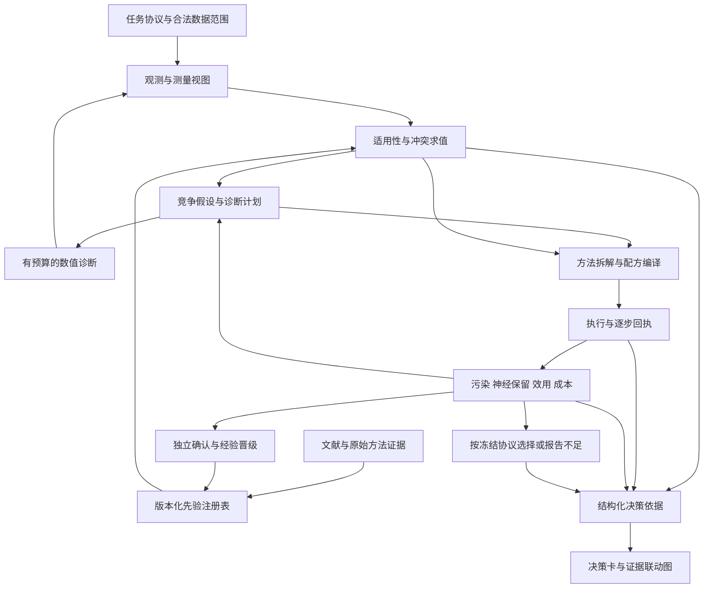

> 历史材料。逐被试拟合、个体预处理及前沿性能目标已撤回；现行范围见 [实施状态](current-implementation-status.md)。

**神经先验预处理系统：实现路线与验收计划**

> 实施进展（2026-09-11）：第一条真实数据决策闭环已落地，详见[实现与实测审阅](neural-prior-implementation-review.md)。以下保留完整目标规划；具体已完成范围以该审阅中的代码与验证记录为准。

2026-09-11。依据：[缺口分析](neural-prior-gap-analysis.md)、[当前能力快照](sources/neural-prior-capability-audit-2026-09-11.json)、[现有个体化范式](current-implementation-status.md)。这是后续实施规划；本文列出的新模块、字段、接口、实验和阈值均未因写入文档而实现或生效。

**1. 实现方向与边界**

采用“版本化知识注册表＋确定性规则与数值工具＋LLM 研究/提案＋证据回执”的架构。首期使用现有 JSON/Pydantic、存储和工作流，不为知识图谱形式先引入图数据库，也不为检索形式先部署向量库；只有全文数量、查询性能与召回评估确实需要时再选择索引。

LLM 负责发现问题、抽取候选知识、组织竞争解释和提出行动；程序负责数据权限、条件求值、参数合法性、测量、运行、统计和已冻结的选择规则。自动化通过明确条件运行；需要的是证据充分时自动继续、缺证据时有合法替代路径，不是每步人工确认。

先在 EEGMMIDB MI 建立一条完整纵向闭环，再扩充方法和任务。现有 EEGNet 三种子主分数、CSP-LDA 对照及历史结果保持原协议。当前固定试次合同下，不得通过新增自动剔除算子隐式缩小评价分母。新增拒绝/弃权能力需要独立协议，报告 coverage 与 risk，并规定未预测样本如何计入目标。

**2. 目标数据流**

图中的循环均受预算、数据权限和停止条件约束。独立确认结果只能影响未来新版本；不能回流修改当前确认运行的策略或记忆。

**3. 需要新增或统一的核心合同**

| 合同 | 最小字段/语义 | 复用与新增建议 |
| --- | --- | --- |
| TaskNeuroProfile | task、人群/设备已知与未知、事件语义、分析目标、保护量、ROI/频带定义、真实基线、部署权限 | 衔接 SurveySnapshot/CollectionSnapshot；新增任务级模块 |
| ClaimEvidence | source_id/version/hash、原文定位、读取范围、claim、支持/反驳关系、研究设计、适用域、实现偏差 | 扩展现有 Evidence/ResearchSource，不用单一来源分数覆盖这些字段 |
| NeuroPrior | id/version、类别、claim、证据引用、条件谓词、未知策略、建议/限制/允许动作、参数先验、反例、风险、诊断与预测 | 扩展 ResearchRule/ScientificPrior；用显式映射连接历史 ID |
| PriorEvaluation | 输入上下文 hash、rule_version、true/false/unknown、缺失观测、冲突、匹配/豁免理由、动作影响 | 所有规则求值均产生回执；不能只记录违反规则 |
| SignalView | 父视图、记录/试次 ID、单位/通道/参考/坐标、采样率、通带/频响、时间支撑/边界、秩/投影、用途及权限 | 统一现有 SignalView 与 runner state；诊断、拟合、应用、评分可不同 |
| MethodIR / UnitContract | 数据/模型/决策端口、操作及版本、fit/apply mask、参数来源、前后条件、风险、坐标兼容、资源估计、验证范围 | 复用 Step 的 model_from/decision_from；搜索配方升级为有类型图 |
| DiagnosticSpec / Result | 目标问题、输入视图、允许信息、计算版本、成本、度量/不确定性、有效/缺失状态、输入输出 hash | 沿用现有测量与制品存储；新增注册与调用动作 |
| EvaluationProfile | 数据状态、污染残余、神经保护、下游效用、稳健性、覆盖、成本；各自 comparison_contract | 在现有 assessment 上加版本化轴；不在旧字段偷偷加入新权重 |
| EvidenceDecisionRecord | 观测 refs、规则求值、候选与排除原因、预测、选择、实际执行、反例、结论限制 | 搜索日志与用户展示共用同一份数据 |
| ExperienceRecord | 数据域、权限、先验版本、实验设计、结果、适用/失效条件、确认状态、可复用范围 | 后期知识晋级；不是把 LLM 总结直接写成通用规则 |

建议先验状态：`discovered → evidence_checked → formalized → executable_validated → empirically_evaluated`，另有 `disputed/retired`。这些状态分别表示处理阶段，不是越来越接近科学真理的通用评级。方法状态另行记录，避免“规则验证通过”被误读为“方法在真实数据上有效”。

首期不为每条生理先验填写一个伪精确的概率。证据强弱、适用性和本数据测量不确定性应分栏；有足够独立实验后才对效果预测做概率校准。

**4. 条件求值与自动行动规则**

| 情形 | 应执行的行为 |
| --- | --- |
| 数学条件违反，如目标频率超过真实可用带宽 | 拒绝对应操作并展示约束；不得自动改成名称相同但含义不同的操作 |
| 实现合同不满足，如当前 ASR 校准空间不兼容 | 选择兼容路径或明确失败；仅使用预定义且有回执的 fallback |
| 经验先验适用且证据足够 | 优先建议候选或诊断；不自动把经验转换成硬禁止 |
| 软先验存在反例/冲突 | 保留两条竞争路径，登记区别性观测和最小对照；结果可能推翻先验解释 |
| 关键条件未知 | 求值为 unknown；查询合法元数据或运行诊断，无法补齐则阻止依赖动作 |
| 非关键生理观测缺失 | 继续独立且合法的处理，保留缺失；收窄结论，不填零、不假定正常 |
| 诊断不足以区分解释 | 报告未决；保持冻结策略或运行有预算对照；不编造污染标签 |
| 成本过高或信息边际收益不足 | 记录未试方向与停止理由；计算故障不等于方法低效用 |

知识发现预算与数值实验预算分开。可在运行中研究新来源，但新规则先进入候选区；需要改变冻结空间或选择协议时开启子研究/新版本，并保留旧运行可重放。不能让联网检索悄然改变同一次比较的规则。

**5. 工作包与依赖**

以下规模为粗略工程估计，单位为有效人周，包含相应回归，不含专家等待、全文获取、完整训练计算和独立数据收集。不能据此承诺日历交付时间。

| 工作包 | 实施内容与落点 | 对应缺口 | 前置 | 验收条件 | 规模 |
| --- | --- | --- | --- | --- | --- |
| W0 范围与能力清单 | 固化 MI TaskNeuroProfile；从 OPERATIONS/catalog/space 自动生成能力矩阵；定义决策与评价语义 | G01/G12/G24/G32 | 无 | 52/11/14/10 各自可解释；缺元数据保持未知；旧协议不变 | 0.5–1 |
| W1 统一先验与证据 | 在 search 邻近新增知识合同/注册入口；迁移科学规则与解读卡的引用，构造首批条件先验族 | G02/G05/G07/G08/G09/G13 | W0 | 规则有来源、条件与反例；未知不当 false；冲突有回执；重复文本不形成矛盾真源 | 1–2 |
| W2 最小诊断闭环 | 扩展 SignalView、request_diagnostic、诊断缓存与预算；先复用 PSD/工频/坏道/秩指标；运行匹配对照 | G15/G16/G20/G22 | W1 | 观测→规则→候选→预测→实测可重放；原生与共同视图可区分；无标签权限强制执行 | 1.5–3 |
| W3 方法形成与晋级 | MethodIR、参数证据映射、单元前后条件、验证后入搜索空间；先完成一个额外分支方法 | G10/G11/G13/G14/G15/G18 | W1，执行依赖 W2 | 不支持步骤不静默替代；模型/数据端口兼容；源码不直接晋级；接入方法有数值与真实子集证据 | 2–4 |
| W4 神经保护评价 | TFR/ROI/侧化、可靠谱峰与非周期分析、移除信号、频响/边界；方法鲁棒性与三轨重建 | G17/G19/G21/G22/G23/G24 | W2；具体方法依赖 W3 | 无峰/无基线正确降级；不过度缩放获益；电压与空间表示分开；保护指标不私改 BA | 2–4 |
| W5 决策展示与忠实性 | EvidenceDecisionRecord API；扩展现有 overview/assessment，联动规则、观测、原文和图；反事实条件测试 | G27/G28/G29 | W1 后先做骨架，W2/W4 后补完整 | 用户能追到当时依据；未运行对照不显示结果；缺失与历史知识不回填 | 1–2 |
| W6 调研覆盖与治理 | 扩展 survey 议题与阅读策略；来源/版本/冲突管理；停机与覆盖记录 | G03/G04/G05/G06/G32 | W1 | 能回答“未覆盖什么、为什么”；只读摘要不能晋级参数规则；更新不污染旧运行 | 1.5–3 |
| W7 系统确认 | 同预算消融、源仿真/模板/真实数据验证、独立被试与部署协议评价、解释审计 | G20/G23/G25/G26/G29/G32 | W2–W6 的冻结版本 | 决策合法性与科学有效性分开报告；开发和确认数据隔离；无收益也形成完整报告 | 2–4＋计算 |
| W8 条件经验与推广 | 经验晋级、个体/会话层次、稳定性和风险校准；增加一个明确任务插件 | G19/G30/G31 | W7 | 知识不跨测试折泄漏；未见人/任务按自身协议验证；负迁移可观察并回退 | 3–6＋外部验证 |

完整首任务体系 W0–W7 约 12–23 人周的初步量级；主要不确定性在方法分支、诊断计算、领域验证和数据可用性。W8 单列。先完成 W0/W1 与 W2、W5 的小范围纵向切片，形成首个可审阅里程碑，再用实测工作量修正估算。

**6. 第一里程碑：先让一条决策链真正可信**

选择“工频是否需要处理”作为首条纵向切片，并以“坏道还是共同活动”作为第二条。选择理由是它们能够利用现有算子和诊断，同时暴露条件求值、视图、对照、未知和用户解释等共性问题。

1. 冻结任务、权限、知识版本和开发面板；生成能力清单。
2. 读取真实采样率、通道类型、处理历史和频带，生成 SignalView。
3. 在允许的原生/诊断视图运行工频观测；频段不可用时返回未知或不适用。
4. 记录“实测峰支持污染”“分析滤波可能已足够”“峰的其它来源”及适用证据。
5. 编译不增加陷波与增加合法陷波的匹配候选；保持同被试、试次、训练配置和成本协议。
6. 预登记污染残余和任务信息改变的观测预测，保存每步实际应用。
7. 按原有 EEGNet 规则选优，单独展示神经保护证据是否足够；不产生新的总质量分。
8. 页面展示完整证据卡；更改输入条件能在回放中改变规则适用结果和对应解释。

完成标准：这一链路在有工频、无明显工频、频段不可测、无需额外陷波、条件冲突和执行失败场景均有可核对结果。首期不需等待所有 52 单元接入，也不以单个演示成功代替独立效果确认。

**7. 方法接入顺序**

| 顺序 | 内容 | 关键准入条件 |
| --- | --- | --- |
| 第一组 | 现有滤波/参考/坏道/ASR/EA 的先验、视图与副作用补全 | 当前实际行为与注册表一致；原有数值回归通过 |
| 第二组 | ICA 拟合/应用分支和成分诊断，继而评估自动分类/删除 | 真实辅助通道核验、无 EOG 替代路径、rank/参考/通道兼容；ICLabel 域偏移验证 |
| 第三组 | 鲁棒参考、桥接诊断、局部坏道修复、CSD 等有明确问题驱动的路线 | 几何和单位完整；诊断与处理分开；共同表示和模型比较明确 |
| 第四组 | MWF/wICA/RELAX 组合、Autoreject、其他复杂方法 | 原作者顺序/掩码/参数语义核实；分母协议兼容；拟合泄漏与计算成本可控 |

不是每个数据集都要跑完四组。REST、源模型及需要新传感器/个体头模的方法根据任务和输入再决定。ERP、SSVEP 和临床应用作为独立任务插件规划，不从当前 MI 自动泛化。

**8. 可视化实现清单**

| 用户问题 | 图与交互 | 必须绑定的证据 |
| --- | --- | --- |
| 为何要处理这里 | 原始连续信号、PSD、通道/时间异常图；可选诊断 ROI | 片段选择规则、通道/时间范围、实际测量视图与规则状态 |
| 实际移除了什么 | 同一片段处理前/后/差值联动；各自坐标不同时禁止直接相减 | 同一 trial/record ID、匹配单位/参考/时轴、实际应用标记 |
| 神经信息受影响吗 | TFR/ERDS、左右 ROI 变化、可用谱峰/非周期拟合、移除信号中的任务结构 | 原始基线、估计方法、有效支撑区、样本量、不确定性和不能推断的内容 |
| 算法为什么是此顺序 | 带数据/拟合/决策端口的配方图；规则触发与参数来源 | 规则版本、来源、模型适用空间和运行回执 |
| 为何没选另一方案 | 配对效用/污染/保留比较、成本与失败覆盖 | 已运行对照、固定分母、研究阶段；未运行项仅显示预期 |
| 对个人是否适用 | 逐人效果与缺失、诊断触发覆盖、个人与会话条件 | 合法校准信息、策略版本、是否为独立确认 |

图上统计带明确区分窗口分位数、被试差异、种子差异和置信区间。ROI、频带或时间窗不能看完同一确认数据后再选。首期沿用已有 SVG/JSON 下载与分页机制；大数组按需加载。以后若增加视觉模型读图，需要记录所见图像与数值依据；视觉判断不能替代数值计算。

**9. 调研如何做到“尽可能充分”**

每个先验族分别搜基础机制、方法原文、实现代码/补充材料、比较验证、失败/反证和适用域。先沿现有 43 来源与知识 gap 展开，不从零堆文献。建立如下覆盖行：

`先验族 × 任务/人群/设备 × 观测/算法 × 正证/反证 × 方法/代码/验证`。

每行保存查询、来源与日期、去重 ID、纳入/排除理由、实际读取范围、未获取材料、待验证 claim。优先解决会改变当前可执行选择的缺口。引用量与仓库 star 只作来源背景，不能作为规则可信度。

停止条件采用明确状态：主要适用主题已有基础/方法/实现/反证材料；预先定义的增量检索轮次未产生新的可用条件规则；或预算/访问条件耗尽。轮次数是可配置工程策略，不能叫“文献已穷尽”。检索结束必须报告仍为空的行及其对自动执行/解释的影响。

普通检索只能提出候选知识；进入正式规则前需要段落核对、适用域审查、规则测试及运行版本绑定。未来更新可以批量进行，但本计划没有创建任何定时自动任务。

**10. 测试、验证与科学确认**

| 层级 | 重点场景 | 通过的含义 |
| --- | --- | --- |
| 合同与规则 | true/false/unknown；来源缺失；冲突；过期；输入类型错误；旧知识读取 | 规则合法可追溯，不证明经验规律正确 |
| 数值与表示 | 单位变换、参考/秩改变、通道重排、基线缺失、采集断点、短片段、频段不可测、模型重载 | 度量与运行满足合同 |
| 防伪改善 | 恒等、零输出、整体缩放、窄带截断、复制/插值导致高相关、只删难试次 | 指标与报告不能把这些自动判为神经保留改善 |
| 方法语义 | 原文参数与实现一致、拟合/应用域兼容、不支持步骤阻断、实际跳过有回执 | 指定方法/参数范围具备可运行性 |
| 信息隔离 | 目标计分标签扰动不改变预处理动作；未来样本不可读；源端和目标端权限不同 | 满足冻结部署协议；评分本身当然可因标签扰动改变 |
| Agent 反例 | 错误先验、互相矛盾来源、缺 EOG、无典型 μ 峰、神经活动似伪迹、预测失败 | 能纠正解释、保留未知、作合法选择 |
| 解释忠实性 | 移除某条依据/改变适用条件后的规则与动作回放；事实与文献结论抽审 | 能审计理由是否存在且支持声明；回放一致仍不等于因果证明 |
| UI/端到端 | 点击证据定位、历史知识、缺失曲线、未执行对照、失败运行、离线导出 | 用户看到的与记录一致 |
| 独立效果确认 | 仿真、真实模板、多被试/记录及未见数据；重复校准与负对照 | 在明确范围内评价效用、损伤风险、成本和泛化 |

系统消融建议：现有系统；仅增加统一静态先验；加入动态诊断；完整保护评价与解释闭环。与既有随机/一次提案/枚举控制器保持相同候选合法域、标签权限、测量权限和总预算，并记录诊断、阅读、训练成本。若比较“先验可扩大搜索域”的系统收益，另设实验，不能与控制器本身的收益混算。

确认阶段需外层未见被试，内层完成先验选择、方法选择、阈值与模型训练；整批转导、预校准、在线、少标签分别评测。当前已被用于规则开发的数据不能凭重新分折就变成完全独立证据。知识库和跨运行记忆也属于策略，需要隔离。

首个真实候选测成本后再定预算。五折、三种子对应每候选 15 次 EEGNet 训练及 CSP-LDA 对照，扩展诊断与方法会再增加成本。不得为了按时交付暗减种子、被试或试次。本次规划未恢复长时间真实搜索。

**11. 最终可交付状态**

工程完成需要每个重要决策能追到合法观测、规则版本、方法参数、实际执行和结果，且未知、失败、反例有位置。科研完成则还需要同预算控制和独立确认，证明先验提高了决策效率、效用或风险表现；也允许结果表明部分先验无效或有害。

建议首个可用版本的验收门槛：当前支持域内所有关键决策引用均可解析；缺失信息不被冒充为已知；运行按冻结版本可重放；原协议回归通过；至少完成上述两条诊断决策链；完成一次独立于演示的场景验收。所有比例必须有明确分母，引用完整率不能被称为总体可信度。

下一步实施起点是 W0/W1 与工频纵向切片。先让现有方法在一个清晰问题上“知道为什么做、用什么证据做、怎样知道做错了”，再扩大调研、算子、个体化与跨任务经验覆盖。
