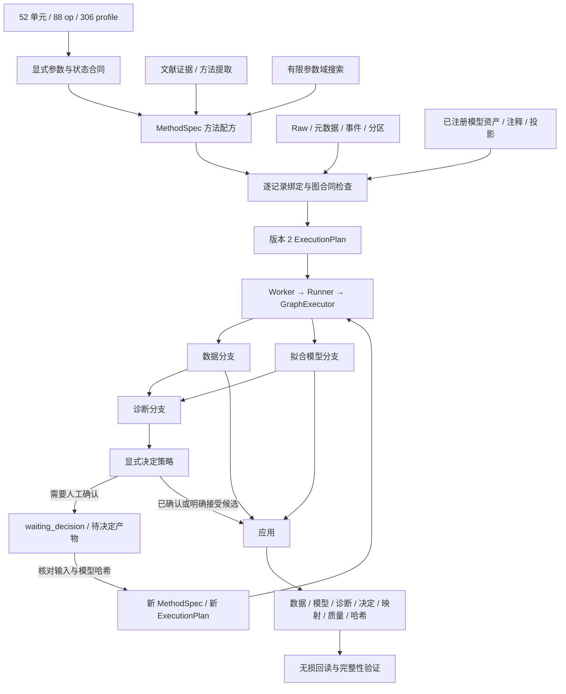

> 历史材料。逐被试拟合、个体预处理及前沿性能目标已撤回；现行范围见 [实施状态](current-implementation-status.md)。

# BrainAgent 全量预处理图执行系统

实际验收数量、完整证据文件和浏览器截图见[验收结果](sources/full-unit-integration-20260912/acceptance.md)。

本次核查基于工作区源码，目录有 **52 个单元、88 个 op**。原先 11 个单元 ID、14 个操作属于 v1 受限执行入口，继续保留。首次冻结的 130 个 profile 在逐源码分支核查后扩展为 **306 个 profile**；原始身份没有删除、合并或改名。详细参数、来源、输入输出和每条运行收据全部列在 [全量矩阵](sources/full-unit-integration-20260912/matrix.md)，机器可读版为 [matrix.json](sources/full-unit-integration-20260912/matrix.json)。

验证状态以 [最终收据索引](sources/full-unit-integration-20260912/final-receipt-index.json) 为准。它区分编译、实际执行、来源数值一致性、边界行为和真实 EEG，不把来源材料的验证声明计为本项目结果。`backend/app/preprocessing/units/verification_v2.json` 仅由检查过实际产物哈希的发布脚本生成；源码或执行器变化后，前端会把旧证据标成历史记录。

## 从基本单元到实际结果



`operations_v2.py` 为每个 op 定义输入表示、状态效应、模型种类、拟合及决定要求、依赖和 profile。`contracts_v2.py` 提供封闭参数词汇、默认值、类型、范围、枚举和跨参数约束。源码函数仍执行数据相关的最终数值合同检查；编译成功不意味着输入数据已经通过所有数值检查。

Step 显式选择 `implementation_version="2"`。一个方法的图节点必须按依赖顺序列出，`input` 指定数据分支，`model_from` 指向兼容的模型生产节点，`artifact_inputs` 读取诊断端口，`asset_inputs` 引用已注册科学资产。模型生产节点同时保留数据端口与模型端口；方法的 `output` 可以选择任意已执行的数据节点，诊断分支无需成为最终输出。

`parameter_inputs` 是封闭的数据构造协议：`literal`、`port`、`object`、`array`、`digest`、`equal`、`greater`、`less`、`nonzero`。端口可声明完整的数组转置轴序；比较仅允许同形状数组或标量阈值。它用于把 ICLabel 类别变为布尔掩码、把相关性阈值变为成分索引、把 ADJUST/FASTER 的输出组成 SASICA 外部评估对象。没有 `eval`、任意函数名或用户代码执行入口。

## 参数绑定与数据合同

| 绑定 | 含义 |
|---|---|
| `$eeg_channels`、`$eog_channels`、`$all_channels` | Planner 根据逐记录通道元数据绑定，缺失选择不能虚构 |
| `$event_id` | 上游 Survey 中已确认的事件码 |
| `$profile.name` | PlanRequest 的显式科学参数；缺失时编译失败 |
| `$events`、`$trial_ids` | 当前分支的事件与原始 Trial 身份 |
| `$times`、`$axes` | 当前 Epochs/数组的时间轴和通道顺序 |
| `$reference_id` | 当前分支的参考版本 |
| `$scope` | 执行器选出的实际拟合样本或 Trial 范围 |
| `$n_samples` | 当前拟合输入实际样本数，用于 ASR `stop`；随每条记录及作用域变化 |

占位符替换整个值，如 `"picks":"$eeg_channels"`，不能写成 `["$eeg_channels"]`。`input_channels` 用于显式投影通道；`input_representation="array"` 将 Epochs 映射为 trial × channel × time 数组并保留坐标模板。

裁剪、拼接、重采样、Epoch 提取、Trial 拒绝、删道及 CSD 使用各自声明的状态转移。原始事件行索引和 Trial ID 沿数据分支传递；重采样保存源实现的事件舍入/碰撞诊断，Epoch 重复事件继续由合同拒绝。非最终数据分支上的拟合范围选择不会被误计为最终 Trial 丢失。

`epoch_with_nonfinite` 按来源语义标记无效区间并丢弃相交 Trial，临时替换的连续信号不会作为修复结果导出。允许 NaN 传播的 profile 明确保留该策略；Inf 输出仍会被拒绝。PyPREP 检测产物可携带待修复 NaN，与后续确定坏道及原生插值分开。CSD 输出按每个通道记录 `V/m²` 或原有电压单位，不能继续套用只接受电压的算子。

源码输入边界通过实际执行核对：通用 `filter` 只接受 Raw；Butterworth 接受 Raw/Epochs；CTPS 必须从 Raw ECG 检出 R 峰；相关性 ECG 分支可接受 Epochs。该差异已纳入编译合同和补充的预期拒绝测试。

## 拟合、模型和决定

模型绑定保存数据身份哈希、模型哈希、通道顺序、坏道、参考、采样率、投影状态、记录及实际作用域。每个参考操作生成包含步骤身份的参考版本，避免两种不同的自定义参考因名称相同而错误共用模型。应用前检查这些字段；逐数据拟合的参考模型和 PREP finalize 还要求精确的数据版本。MNE ICA 的矩阵、拟合设置、PCA 方差、拟合信息及排除状态参与保存和哈希，不能换用其他拟合模型的分类结果。

| 拟合方式 | 实际行为 |
|---|---|
| `fit_scope.role=train/calibration` | 仅接受记录中存在且角色一致的分区；先裁出分区再重放允许的确定性前处理，避免滤波跨越测试边界 |
| `adaptation_scope=record_unlabeled` | 对明确选定的当前处理分支逐记录适配，不重拟合上游模型或重放上游人工决定；实验条件和数据哈希写入产物 |
| `subject_unlabeled`、`online` | 当前来源的批处理拟合器没有该实现，明确拒绝；不自动转成逐记录适配 |

训练/校准范围重放目前只支持不依赖模型、诊断决定及外部参数端口的确定性前处理。需要在状态化清理之后再做分区拟合的复杂实验仍需扩展作用域图合同，不能直接复用全记录适配产物冒充训练拟合。

带非空实验因素的回归基线拟合必须声明 train/calibration 分区，不能默认声称无标签适配。底层只接受 train/calibration 的来源函数在逐记录无标签模式下使用带记录身份的 calibration 调用范围；实际实验模式仍单独保存为 `record_unlabeled`，不表示它使用了预留校准分区。

检测结果不会自动变成已批准决定。决定型操作要求 `decision`：

- `manual`：第一次运行保存输入/模型哈希及完整待决定参数，任务进入 `waiting_decision`；界面显示诊断及产物下载。确认必须带当前哈希及理由，生成新的方法和计划，原任务、原决定和原结果保留。
- `accept_candidates`：配方必须明确声明接受候选的理由，并通过 `decision_from` 与诊断参数端口提供掩码、成分索引等；检查数据和模型绑定。`decision_target=output` 只用于明确针对诊断输出的数据版本。
- SASICA 自身的人工 review 仍遵守来源的 component/assessment/reviewer/timestamp 合同；没有 review 时，各成分状态为 pending。若工程配方决定自动接受候选，这一策略会单独记录，不将其伪装成人工审核。

## 已执行的完整实例

[代表性 MethodSpec 全量 JSON](sources/full-unit-integration-20260912/representative-methods.json) 与 [逐记录 ExecutionPlan 全量 JSON](sources/full-unit-integration-20260912/representative-execution-plan.json) 来自实际运行，包含已绑定参数、依赖及实现哈希。

真实 EEGMMIDB 的 S001R04 和 S001R08 各执行两套配方：

1. 平均参考 → 1–40 Hz IIR → PICARD 逐记录无标签拟合分支 → muscle slope 诊断 → 明确接受阈值 0.8 的候选 → ICA 应用 → 0–2 s Epoch → 0–0.2 s baseline。
2. nanmedian 参考波形估计模型 → 同数据版本参考应用 → 8–30 Hz Butterworth → Epoch → window MAD 诊断分支，同时保留 baseline 数据输出。

第一套配方在两条记录分别排除 1 和 0 个 IC。四个结果各保留 15 个 Trial，形状为 `15 × 64 × 321`，均完成保存、回读及原始文件哈希核对。本次真实记录没有用于验证 EOG、ADJUST 或依赖空间位置的 muscle spatial 分支；不会据此给那些 profile 标记真实数据通过。

另有可重复合成信号组合：

- ICLabel → 类别比较产生眼动成分掩码 → RELAX eye weights → targeted WICA；比较来源结果，并验证错用模型权重会失败。
- ADJUST 和 FASTER 两条诊断分支 → 组装来源身份及评估哈希 → SASICA → 显式策略 → ICA apply；核对外部评估的数据绑定。
- CCA fit → canonical correlation 阈值 → `nonzero` 成分索引 → CCA apply；验证改动模型、重排通道会失败。
- Raw 上的校准 EOG 回归模型 → Epochs 应用；裁剪/拼接/拒绝之后的 Trial 身份保持；源数据修改测试证明校准拟合不读取测试分区。

这些运行使用合成时域/频域信号、标准电极几何、明确的 EOG/ECG 信号和固定随机种子。合成的 blink 掩码或人工决定在收据中标明测试用途，不声称为真实人工 EEG 判断。

## 界面、API 与搜索

前端入口为 `/preprocessing/units`，对话页侧栏已有链接。界面提供全量搜索、状态过滤、来源及参数合同、步骤 JSON 编辑、模型/决定分支、最终数据输出选择、资产注册、当前输入检查和有限域候选编译。计划卡可实际提交、取消、重试、下载及确认待决定任务。

| API | 用途 |
|---|---|
| `GET /api/preprocessing/capabilities` | 306 条能力及分级证据，显示当前代码是否与收据一致 |
| `POST /api/preprocessing/capabilities/input` | 根据归属当前用户的输入引用检查元数据前置条件 |
| `GET /api/preprocessing/graph-search/space` | 全量可发现操作、有限可调参数域、组合约束 |
| `POST /api/preprocessing/graph-search/plans` | 指定 MethodSpec 和 `step.parameter` 有界网格，逐候选/逐记录筛查并编译 |
| `POST /api/preprocessing/assets` | 将前向模型、投影、注释从允许的数据根目录读入并冻结哈希快照 |
| `POST /api/preprocessing/methods`、`/plans`、`/jobs` | 方法注册、计划编译、异步任务提交 |
| `GET/POST /api/preprocessing/jobs/{job_id}/decisions` | 读取待决定内容 / 确认后生成新计划 |

搜索只开放列出的有限工程候选，不开放任意参数值。裁剪区间、训练范围、事件标签、模型资产、掩码及人工决定不会作为自由调参变量。不同 profile 可以被选择和编排，但不会自动把全部算子串起来。

通用图搜索与原有 EEGNet 固定评估面板是不同输出合同。现有固定面板的 v1 搜索继续可用；v2 图可生成和实际执行候选，但尚未接入该固定面板的评分、Trial 对齐与统一排名。编译器明确拒绝把 v2 任意产物送入旧评估合同，不能宣称 88 个 op 都已参与旧 EEGNet 搜索排名。

方法提取向模型提供全量 v2 参数、profile 和依赖合同，保留证据索引与未解决检查项。没有配置提取模型、没有全文证据或无法确定科学参数时，仍返回明确缺项，不捏造配方。

## 保存、回读和兼容

每个记录尝试保存在独立的 `runs/<job>/rNNNN/aN/` 目录，包含：

- 原始文件的只读工作副本及输入哈希核对；源路径不被修改。
- 每步 `execution.json`、`artifacts.json`、模型绑定、决定或 `pending-decision.json`。
- `final/data.json` 及对应 FIFF/NumPy 数组；完整 MNE Info、通道、单位、注释、时间、事件、selection/drop_log。
- `axes.json`、`events.json`、`delta.json`、`provenance.json`；原始 Trial ID、被移除原因、通道映射、质量变化、环境和原生依赖哈希。
- 失败时的 `failure.json` 和已完成步骤；重试使用新尝试目录并跳过已经验证完整的记录。

Codec 使用封闭类型集合，禁止 pickle、任意反序列化构造。包含 Raw、Epochs、数组、ICA、EOG、ASR、AutoReject、显式 CV 折、前向模型、稀疏源空间矩阵、投影、注释和复数标量。每步写出后立即读回核对，最终再检查全部文件哈希、实际信号、时间轴和 Trial 映射。

旧方法、旧结果和旧操作白名单继续走 v1；不会把 v1 操作自动改成 v2 的更宽参数域。新增计划和结果显式写 `schema_version="2"`。历史计划的执行代码哈希不匹配时必须重新编译，历史已保存结果仍由对应版本读取器验证。人工确认也通过新计划版本保留历史。

v2 当前按记录顺序执行。取消在步骤边界生效，长时间作者算法调用依赖自身 timeout，尚不支持在每个原生子进程内即时中断。测试覆盖取消前不执行算法、等待决定时不应用、部分失败后保留已完成记录的重试。

## 可复现依赖与启动

`backend/.venv-eeg` 原有环境没有安装、卸载或升级包。前期验证使用隔离增量环境 `.venv-units`；随后依据完整锁定清单从零建立 `.venv-units-repro`，不依赖前者的 `.pth`。独立环境安装收据位于其 `bootstrap-receipt.json`，`pip check`、回归和额外组合测试均在新环境运行。环境版本见 [reproduced-environment.json](sources/full-unit-integration-20260912/reproduced-environment.json)。

```powershell
cd E:\work\BrainAgent\backend
# 用 Python 3.12 创建一个此前不存在的目录；脚本拒绝覆盖现有环境。
.venv-eeg\Scripts\python.exe -m scripts.bootstrap_units_v2 --environment .venv-units-new --assets ..\.local\unit-assets-new

# 在配置好项目原有 .env 后，用完整环境启动真实 API 与独立 Worker。
.venv-units-repro\Scripts\python.exe -m uvicorn app.main:create_app --factory --host 127.0.0.1 --port 8000
# 另开一个终端，使用同一 preprocessing root / input roots 配置。
.venv-units-repro\Scripts\python.exe -m app.preprocessing.worker
```

前端运行 `pnpm dev:web` 后访问 `/preprocessing/units`。也可先 `pnpm exec vite build`，运行 `python -m scripts.preview_units_v2 --root ../.local/units-v2-preview` 启动隔离的合成数据验收界面；该脚本为测试预览，会在指定新目录生成合成 BIDS 数据并启动 Worker，不用于生产部署。

Python 依赖完整版本锁在 `backend/requirements-units-v2.lock.txt`。作者运行时采用独立的 Octave 11.3.0 Windows 包，额外编译 signal 1.4.8 与 statistics 1.7.7，使用包内 optim 1.6.3。下载脚本固定归档哈希和作者提交：CleanLine `117bffa6…`、Zapline-plus `f4628a32…`、MARA `24e36719…`、SASICA `9ab76d75…`、EEGLAB `6d3c2730…`。源码/model asset 哈希在计划和每步诊断中保存。

Zapline 在 Windows 下的 Python 回调命令引用方式已修正；MARA/ADJUST 使用无用户初始化文件的原生会话及临时用户偏好目录。原始算法函数保持来源语义，目录中同时记录 upstream hash 和工程修改理由。原始 EEG-ASR、EEG-INTERPOLATE 与工程 EEG-ASR-AUTO、EEG-AUTO-BAD-CHANNEL 各有独立 op、参数、收据和状态，未互相替代。

作者依赖问题的实际处理：最初 ADJUST 的短文件清单漏掉 EEGLAB 检查器传递调用的辅助函数，已补齐固定作者提交中的 adminfunc/sigprocfunc/popfunc 目录；未把缺失算法换成 Python 近似清理。下载归档、辅助文件以及便携运行时的来源/哈希见 [native-assets.json](sources/full-unit-integration-20260912/native-assets.json)。运行和再分发继续遵循各来源原有许可证；本项目的适配不改变其授权。

## 重跑验证与证据边界

```powershell
cd E:\work\BrainAgent\backend
.venv-units-repro\Scripts\python.exe -X utf8 -m scripts.validate_units_v2 --output ..\.local\unit-recheck\profiles
.venv-units-repro\Scripts\python.exe -X utf8 -m scripts.validate_variant_combinations_v2 --output ..\.local\unit-recheck\variants
.venv-units-repro\Scripts\python.exe -X utf8 -m scripts.validate_graph_compositions_v2 --output ..\.local\unit-recheck\compositions
.venv-units-repro\Scripts\python.exe -m pytest tests/preprocessing -q
```

profile 脚本逐条运行源函数和图适配器，核对数值、模型、诊断、状态及回读。补充脚本覆盖模型拟合变体的应用和 Raw/Epochs 输入组合，包含明确不适用的预期失败；预期拒绝不计为数值运行成功。所有先前失败尝试保留在 `.local/units-v2-audit`，最终索引仅引用当前代码的收据。

本次证据不包括所有连续参数值的笛卡尔积、所有 EEG 数据集、跨操作任意排列的科学有效性、独立复现作者论文所有数值结果，或所有 profile 的真实 EEG 验证。真实 EEG 仅覆盖实际运行的两套配方。上述分区状态化重放、在线/逐被试拟合、旧固定面板统一排名和原生算法内即时取消仍是明确限制，不能计作已完成能力。其他输入缺少 EOG、坐标、作者资产或可用运行时时，前端和 Planner 会如实显示不适用、缺依赖或缺绑定。
