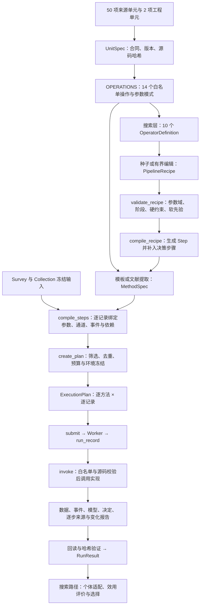
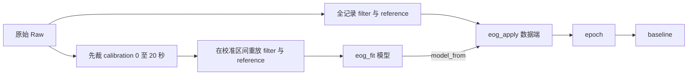

# 预处理基本单元 → 可执行预处理流程：当前实现与全量结果

> 历史快照：本文保留 2026-09-11 的实现和运行证据。2026-09-12 的全量 v2 接入、逐 op/profile 验证及现有限制见[全量预处理图执行系统](preprocessing-integration-v2.md)与[验收结果](sources/full-unit-integration-20260912/acceptance.md)；下文 11 个单元 / 14 个操作的数字不再代表新增 v2 执行入口。

核查日期：2026-09-11。依据当前工作区源码（包含已有未提交修改），不把设计文档、目录源码或历史验证声称当作当前可执行能力。

**当前边界：52 个目录单元 = 50 个来源单元 + 2 个项目自动清理单元；其中 11 个单元 ID 的 14 个操作已接入执行器。搜索层提供 10 个算子，本机及该真实输入满足条件时有 7 个初始配方。** 这不是把 52 个单元全部串行执行，也不是枚举全部可能参数组合。连续参数域与有界编辑产生的配方数量不能用这几个目录数字表示。

本报告的“全量”包括：52 行目录状态、14 个执行合同及参数、10 个搜索算子与参数域、7 个初始配方及每条记录的完整编译步骤、4 个新执行的合成结果、24 个历史真实数据结果、全部 JSON 步骤产物和二进制数据路径/哈希。真实例子覆盖该次小规模运行的全部记录，不代表 EEGMMIDB 全数据集。

## 1. 从定义到执行的完整路径



UnitSpec 描述能力和来源；MethodSpec 描述一个有证据的步骤图；ExecutionPlan 把步骤图绑定到确定的数据记录、实际参数、实现和资源；RunResult 才证明那些记录实际执行后的状态。`input` 连接数据，`model_from` 连接拟合模型，`decision_from` 连接检测决定，因此方法可含分支。搜索配方本身是有序主链，编译器会把诊断算子展开成检测与标记两步。

关键源码：[__init__.py](E:/work/BrainAgent/backend/app/preprocessing/units/__init__.py)；[schemas.py](E:/work/BrainAgent/backend/app/preprocessing/schemas.py)；[recipe_compiler.py](E:/work/BrainAgent/backend/app/search/recipe_compiler.py)；[planner.py](E:/work/BrainAgent/backend/app/preprocessing/planner.py)；[runner.py](E:/work/BrainAgent/backend/app/preprocessing/runner.py)

## 2. 52 个单元的全量接入状态

“未接入”表示不能通过当前 invoke/Planner 执行，并不表示没有源码。各 op/profile 的来源合同和源码定位保存在 [catalog-full.json](E:/work/BrainAgent/docs/sources/unit-to-execution-20260911/catalog-full.json)。本次检查 52 项源码哈希全部与目录一致。

| 序号 | Unit ID | 当前开放 op | 源代码 |
| --- | --- | --- | --- |
| 1 | EEG-CROP | 未接入 | [eeg_crop.py](E:/work/BrainAgent/backend/app/preprocessing/units/source/eeg_crop.py) |
| 2 | EEG-DETREND | detrend | [eeg_detrend.py](E:/work/BrainAgent/backend/app/preprocessing/units/source/eeg_detrend.py) |
| 3 | EEG-FILTER | filter, notch | [eeg_filter.py](E:/work/BrainAgent/backend/app/preprocessing/units/source/eeg_filter.py) |
| 4 | EEG-SINE-REGRESSION | 未接入 | [eeg_sine_regression.py](E:/work/BrainAgent/backend/app/preprocessing/units/source/eeg_sine_regression.py) |
| 5 | EEG-RESAMPLE | resample | [eeg_resample.py](E:/work/BrainAgent/backend/app/preprocessing/units/source/eeg_resample.py) |
| 6 | EEG-REREFERENCE | reference | [eeg_rereference.py](E:/work/BrainAgent/backend/app/preprocessing/units/source/eeg_rereference.py) |
| 7 | EEG-REST | 未接入 | [eeg_rest.py](E:/work/BrainAgent/backend/app/preprocessing/units/source/eeg_rest.py) |
| 8 | EEG-CSD | 未接入 | [eeg_csd.py](E:/work/BrainAgent/backend/app/preprocessing/units/source/eeg_csd.py) |
| 9 | EEG-BAD-CHANNEL-LOF | 未接入 | [eeg_bad_channel_lof.py](E:/work/BrainAgent/backend/app/preprocessing/units/source/eeg_bad_channel_lof.py) |
| 10 | EEG-AMPLITUDE-THRESHOLD | amplitude_windows | [eeg_amplitude_threshold.py](E:/work/BrainAgent/backend/app/preprocessing/units/source/eeg_amplitude_threshold.py) |
| 11 | EEG-MUSCLE-DETECT | 未接入 | [eeg_muscle_detect.py](E:/work/BrainAgent/backend/app/preprocessing/units/source/eeg_muscle_detect.py) |
| 12 | EEG-BAD-CHANNEL-MARK | mark_channels | [eeg_bad_channel_mark.py](E:/work/BrainAgent/backend/app/preprocessing/units/source/eeg_bad_channel_mark.py) |
| 13 | EEG-BAD-SEGMENT-MARK | 未接入 | [eeg_bad_segment_mark.py](E:/work/BrainAgent/backend/app/preprocessing/units/source/eeg_bad_segment_mark.py) |
| 14 | EEG-BAD-CHANNEL-DROP | 未接入 | [eeg_bad_channel_drop.py](E:/work/BrainAgent/backend/app/preprocessing/units/source/eeg_bad_channel_drop.py) |
| 15 | EEG-ICA | 未接入 | [eeg_ica.py](E:/work/BrainAgent/backend/app/preprocessing/units/source/eeg_ica.py) |
| 16 | EEG-EOG-REGRESSION | eog_fit, eog_apply | [eeg_eog_regression.py](E:/work/BrainAgent/backend/app/preprocessing/units/source/eeg_eog_regression.py) |
| 17 | EEG-SSP | 未接入 | [eeg_ssp.py](E:/work/BrainAgent/backend/app/preprocessing/units/source/eeg_ssp.py) |
| 18 | EEG-BRIDGE-DETECT | 未接入 | [eeg_bridge_detect.py](E:/work/BrainAgent/backend/app/preprocessing/units/source/eeg_bridge_detect.py) |
| 19 | EEG-BRIDGE-REPAIR | 未接入 | [eeg_bridge_repair.py](E:/work/BrainAgent/backend/app/preprocessing/units/source/eeg_bridge_repair.py) |
| 20 | EEG-INTERPOLATE | 未接入 | [eeg_interpolate.py](E:/work/BrainAgent/backend/app/preprocessing/units/source/eeg_interpolate.py) |
| 21 | EEG-EPOCH | epoch | [eeg_epoch.py](E:/work/BrainAgent/backend/app/preprocessing/units/source/eeg_epoch.py) |
| 22 | EEG-TRIAL-REJECT | 未接入 | [eeg_trial_reject.py](E:/work/BrainAgent/backend/app/preprocessing/units/source/eeg_trial_reject.py) |
| 23 | EEG-BASELINE | baseline | [eeg_baseline.py](E:/work/BrainAgent/backend/app/preprocessing/units/source/eeg_baseline.py) |
| 24 | EEG-ZAPLINE | 未接入 | [eeg_zapline.py](E:/work/BrainAgent/backend/app/preprocessing/units/source/eeg_zapline.py) |
| 25 | EEG-BAD-CHANNEL-ENSEMBLE | 未接入 | [eeg_bad_channel_ensemble.py](E:/work/BrainAgent/backend/app/preprocessing/units/source/eeg_bad_channel_ensemble.py) |
| 26 | EEG-BAD-CHANNEL-DEVIATION | 未接入 | [eeg_bad_channel_deviation.py](E:/work/BrainAgent/backend/app/preprocessing/units/source/eeg_bad_channel_deviation.py) |
| 27 | EEG-BAD-CHANNEL-CORRELATION | 未接入 | [eeg_bad_channel_correlation.py](E:/work/BrainAgent/backend/app/preprocessing/units/source/eeg_bad_channel_correlation.py) |
| 28 | EEG-BAD-CHANNEL-HF-RATIO | 未接入 | [eeg_bad_channel_hf_ratio.py](E:/work/BrainAgent/backend/app/preprocessing/units/source/eeg_bad_channel_hf_ratio.py) |
| 29 | EEG-BAD-CHANNEL-LINE-NOISE | 未接入 | [eeg_bad_channel_line_noise.py](E:/work/BrainAgent/backend/app/preprocessing/units/source/eeg_bad_channel_line_noise.py) |
| 30 | EEG-ICLABEL | 未接入 | [eeg_iclabel.py](E:/work/BrainAgent/backend/app/preprocessing/units/source/eeg_iclabel.py) |
| 31 | EEG-MARA | 未接入 | [eeg_mara.py](E:/work/BrainAgent/backend/app/preprocessing/units/source/eeg_mara.py) |
| 32 | EEG-ADJUST | 未接入 | [eeg_adjust.py](E:/work/BrainAgent/backend/app/preprocessing/units/source/eeg_adjust.py) |
| 33 | EEG-FASTER-IC | 未接入 | [eeg_faster_ic.py](E:/work/BrainAgent/backend/app/preprocessing/units/source/eeg_faster_ic.py) |
| 34 | EEG-SASICA | 未接入 | [eeg_sasica.py](E:/work/BrainAgent/backend/app/preprocessing/units/source/eeg_sasica.py) |
| 35 | EEG-ASR | 未接入 | [eeg_asr.py](E:/work/BrainAgent/backend/app/preprocessing/units/source/eeg_asr.py) |
| 36 | EEG-WICA | 未接入 | [eeg_wica.py](E:/work/BrainAgent/backend/app/preprocessing/units/source/eeg_wica.py) |
| 37 | EEG-CCA | 未接入 | [eeg_cca.py](E:/work/BrainAgent/backend/app/preprocessing/units/source/eeg_cca.py) |
| 38 | EEG-MWF | 未接入 | [eeg_mwf.py](E:/work/BrainAgent/backend/app/preprocessing/units/source/eeg_mwf.py) |
| 39 | EEG-AUTOREJECT | 未接入 | [eeg_autoreject.py](E:/work/BrainAgent/backend/app/preprocessing/units/source/eeg_autoreject.py) |
| 40 | EEG-REGRESSION-BASELINE | 未接入 | [eeg_regression_baseline.py](E:/work/BrainAgent/backend/app/preprocessing/units/source/eeg_regression_baseline.py) |
| 41 | EEG-WINDOW-MAD | 未接入 | [eeg_window_mad.py](E:/work/BrainAgent/backend/app/preprocessing/units/source/eeg_window_mad.py) |
| 42 | EEG-SPECTRAL-SLOPE | 未接入 | [eeg_spectral_slope.py](E:/work/BrainAgent/backend/app/preprocessing/units/source/eeg_spectral_slope.py) |
| 43 | EEG-EOG-STEP | 未接入 | [eeg_eog_step.py](E:/work/BrainAgent/backend/app/preprocessing/units/source/eeg_eog_step.py) |
| 44 | EEG-JOINT-PROBABILITY | 未接入 | [eeg_joint_probability.py](E:/work/BrainAgent/backend/app/preprocessing/units/source/eeg_joint_probability.py) |
| 45 | EEG-KURTOSIS | 未接入 | [eeg_kurtosis.py](E:/work/BrainAgent/backend/app/preprocessing/units/source/eeg_kurtosis.py) |
| 46 | EEG-BLINK-IQR | 未接入 | [eeg_blink_iqr.py](E:/work/BrainAgent/backend/app/preprocessing/units/source/eeg_blink_iqr.py) |
| 47 | EEG-ROBUST-REFERENCE | 未接入 | [eeg_robust_reference.py](E:/work/BrainAgent/backend/app/preprocessing/units/source/eeg_robust_reference.py) |
| 48 | EEG-IC-BLINK-WEIGHTS | 未接入 | [eeg_ic_blink_weights.py](E:/work/BrainAgent/backend/app/preprocessing/units/source/eeg_ic_blink_weights.py) |
| 49 | EEG-CHANNEL-REJECTION-BUDGET | 未接入 | [eeg_channel_rejection_budget.py](E:/work/BrainAgent/backend/app/preprocessing/units/source/eeg_channel_rejection_budget.py) |
| 50 | EEG-MUSCLE-TRIAL-DECISION | 未接入 | [eeg_muscle_trial_decision.py](E:/work/BrainAgent/backend/app/preprocessing/units/source/eeg_muscle_trial_decision.py) |
| 51 | EEG-AUTO-BAD-CHANNEL | detect_bad_channels, interpolate_bad_channels | [automatic_cleaning.py](E:/work/BrainAgent/backend/app/preprocessing/units/source/automatic_cleaning.py) |
| 52 | EEG-ASR-AUTO | asr_clean | [automatic_cleaning.py](E:/work/BrainAgent/backend/app/preprocessing/units/source/automatic_cleaning.py) |

特别注意：原始 `EEG-ASR` 与 `EEG-INTERPOLATE` 仍未接入；当前自动 ASR 和插值分别通过 `EEG-ASR-AUTO/asr_clean`、`EEG-AUTO-BAD-CHANNEL/interpolate_bad_channels` 开放。两个自动清理单元具有明确工程适配合同，不能当作对原始来源 ID 的透明替换。

## 3. 14 个操作的全部参数合同

下表由 Pydantic 模式自动导出。`必填` 表示执行器合同必填；具体取值可由方法占位符或搜索固定绑定提供。`events=$events` 在运行时被当前分支事件数组替换。全部合同禁止额外字段；科学参数拒绝 bool 代替数值；还要继续通过跨参数与真实输入约束。

### EEG-AUTO-BAD-CHANNEL / detect_bad_channels

Continuous Raw -> unchanged Raw + candidates. Engineering consensus_v2: flat OR amplitude with low correlation OR sustained low correlation. Coherent amplitude outliers are diagnostic only, not certified normal; NOT PREP reproduction. Effective thresholds and channel diagnostic classes are saved. Explicit record_unlabeled transductive adaptation, no class labels. Bind mark_channels.decision_from to this step and use its exact input.

| 参数 | 必填 / 默认 | 完整字段约束 |
| --- | --- | --- |
| selection_policy | "consensus_v2" | {"const": "consensus_v2", "type": "string"} |
| adaptation_scope | 必填 | {"const": "record_unlabeled", "type": "string"} |
| window_s | 1 | {"maximum": 5, "minimum": 0.5, "type": "number"} |
| flat_duration_s | 5 | {"maximum": 30, "minimum": 1, "type": "number"} |
| flat_ptp_V | 1e-07 | {"exclusiveMinimum": 0, "maximum": 1e-05, "type": "number"} |
| deviation_z | 5 | {"maximum": 10, "minimum": 3, "type": "number"} |
| correlation_threshold | 0.4 | {"maximum": 0.8, "minimum": 0, "type": "number"} |
| bad_window_fraction | 0.1 | {"exclusiveMinimum": 0, "maximum": 1, "type": "number"} |
| persistent_low_corr_fraction | 0.5 | {"maximum": 1, "minimum": 0.3, "type": "number"} |
| persistent_low_corr_seconds | 5 | {"maximum": 60, "minimum": 1, "type": "number"} |
| shared_correlation_threshold | 0.7 | {"exclusiveMinimum": 0, "maximum": 1, "type": "number"} |

### EEG-AUTO-BAD-CHANNEL / interpolate_bad_channels

Continuous Raw -> same grid/physical V. MNE spherical splines repair currently marked EEG only, require head geometry and max_fraction; preserve auxiliary channels and all events/trials. Clear only successfully repaired EEG marks. Place after ASR and before CAR.

| 参数 | 必填 / 默认 | 完整字段约束 |
| --- | --- | --- |
| max_fraction | 0.1 | {"maximum": 0.25, "minimum": 0, "type": "number"} |

### EEG-ASR-AUTO / asr_clean

ASRpy 0.0.8 Euclidean correction with locally adapted complete-block calibration covariance on unmarked EEG, fixed samples/channels/events. Explicit record_unlabeled transductive calibration, not train-only. Requires full-rank good EEG before CAR/interpolation, high-pass >=0.5 Hz, sufficient clean calibration >=30s, sfreq>82. No EOG/ICA classifier, no time/trial rejection. on_insufficient_calibration defaults to error; explicit identity only handles ASR_CALIBRATION_TOO_SHORT and reports status=not_applicable/asr_applied=false with actual/min seconds. Numerical/rank failures remain errors. Defaults cutoff20, window0.5s require >=1Hz high-pass; calibration mask/matrices and boundary caveat saved.

| 参数 | 必填 / 默认 | 完整字段约束 |
| --- | --- | --- |
| on_insufficient_calibration | "error" | {"enum": ["error", "identity"], "type": "string"} |
| adaptation_scope | 必填 | {"const": "record_unlabeled", "type": "string"} |
| cutoff | 20 | {"maximum": 100, "minimum": 10, "type": "number"} |
| win_len | 0.5 | {"maximum": 2, "minimum": 0.5, "type": "number"} |
| win_overlap | 0.66 | {"maximum": 0.9, "minimum": 0, "type": "number"} |
| min_clean_seconds | 30 | {"minimum": 30, "type": "number"} |
| lookahead | 0.25 | {"exclusiveMinimum": 0, "maximum": 1, "type": "number"} |
| stepsize | 32 | {"minimum": 1, "type": "integer"} |
| maxdims | 0.66 | {"exclusiveMaximum": 1, "exclusiveMinimum": 0, "type": "number"} |
| mem_splits | 3 | {"maximum": 100, "minimum": 1, "type": "integer"} |

### EEG-DETREND / detrend

Remove constant/linear trend on EEG picks; preserve data state.

| 参数 | 必填 / 默认 | 完整字段约束 |
| --- | --- | --- |
| type | 必填 | {"enum": ["constant", "linear"], "type": "string"} |
| picks | 必填 | {"items": {"type": "string"}, "minItems": 1, "type": "array"} |

### EEG-FILTER / filter

Continuous Raw -> Raw; EEG picks only; IIR is fixed fourth-order Butterworth, zero phase. This phase is an implementation choice unless supported by source evidence.

| 参数 | 必填 / 默认 | 完整字段约束 |
| --- | --- | --- |
| l_freq | 必填 | {"anyOf": [{"type": "number"}, {"type": "null"}]} |
| h_freq | 必填 | {"anyOf": [{"type": "number"}, {"type": "null"}]} |
| method | 必填 | {"const": "iir", "type": "string"} |
| phase | 必填 | {"const": "zero", "type": "string"} |
| picks | 必填 | {"items": {"type": "string"}, "minItems": 1, "type": "array"} |

### EEG-FILTER / notch

Continuous finite Raw only; freqs explicit unique ordered [50], [60] or [50,60] Hz, picks explicit EEG names. Existing unmodified MNE FIR zero-phase/firwin kernel, width=freq/200, total transition bandwidth1Hz. Entire stop/transition band must remain below Nyquist. Reject acquisition joins; retain complete sample/channel/event grid. Optional when line-noise overlaps retained spectrum; not automatically required after a sufficiently attenuating lowpass. No fitting or labels.

| 参数 | 必填 / 默认 | 完整字段约束 |
| --- | --- | --- |
| freqs | 必填 | {"items": {"enum": [50.0, 60.0], "type": "number"}, "maxItems": 2, "minItems": 1, "type": "array"} |
| picks | 必填 | {"items": {"type": "string"}, "minItems": 1, "type": "array"} |

### EEG-RESAMPLE / resample

Continuous Raw -> Raw at sfreq Hz, fixed polyphase anti-aliasing. Pass $events; the executor synchronizes target event sample indices, preserving original event identity and recording timing error. Use the same target sfreq across mixed-rate records before epoch. Does not add original frequency information when upsampling.

| 参数 | 必填 / 默认 | 完整字段约束 |
| --- | --- | --- |
| sfreq | 必填 | {"exclusiveMinimum": 0, "type": "number"} |
| events | "$events" | {"const": "$events", "type": "string"} |

### EEG-REREFERENCE / reference

Average reference uses EEG channels, excluding auxiliary channels; preserve data state.

| 参数 | 必填 / 默认 | 完整字段约束 |
| --- | --- | --- |
| ref_channels | 必填 | {"anyOf": [{"const": "average", "type": "string"}, {"items": {"type": "string"}, "type": "array"}]} |

### EEG-EPOCH / epoch

Continuous Raw -> Epochs; events from Collection and event_id from Survey; tmin/tmax in seconds. Does not apply baseline or reject trials.

| 参数 | 必填 / 默认 | 完整字段约束 |
| --- | --- | --- |
| events | "$events" | {"const": "$events", "type": "string"} |
| event_id | 必填 | {"additionalProperties": {"type": "integer"}, "type": "object"} |
| tmin | 必填 | {"type": "number"} |
| tmax | 必填 | {"type": "number"} |
| picks | 必填 | {"items": {"type": "string"}, "minItems": 1, "type": "array"} |

### EEG-BASELINE / baseline

Epochs -> Epochs; subtract baseline mean, NOT percentage ERD/ERS normalization.

| 参数 | 必填 / 默认 | 完整字段约束 |
| --- | --- | --- |
| baseline | 必填 | {"maxItems": 2, "minItems": 2, "prefixItems": [{"anyOf": [{"type": "number"}, {"type": "null"}]}, {"anyOf": [{"type": "number"}, {"type": "null"}]}], "type": "array"} |

### EEG-EOG-REGRESSION / eog_fit

Continuous Raw -> model port; requires real EOG channels and one explicit calibration/train interval id in fit_scope; never fit test data.

| 参数 | 必填 / 默认 | 完整字段约束 |
| --- | --- | --- |
| picks | 必填 | {"items": {"type": "string"}, "minItems": 1, "type": "array"} |
| picks_artifact | 必填 | {"items": {"type": "string"}, "minItems": 1, "type": "array"} |
| reference_id | 必填 | {"minLength": 1, "type": "string"} |

### EEG-EOG-REGRESSION / eog_apply

Data input and model_from from a preceding eog_fit; matching reference_id required. EOG regression does not implement EMG screening.

| 参数 | 必填 / 默认 | 完整字段约束 |
| --- | --- | --- |
| reference_id | 必填 | {"minLength": 1, "type": "string"} |

### EEG-AMPLITUDE-THRESHOLD / amplitude_windows

Continuous Raw -> unchanged Raw plus channel candidates from sliding-window PEAK-TO-PEAK thresholds in volts. Does NOT implement absolute-amplitude trial rejection or apply exclusion.

| 参数 | 必填 / 默认 | 完整字段约束 |
| --- | --- | --- |
| window_s | 1 | {"exclusiveMinimum": 0, "type": "number"} |
| stride_s | 0.5 | {"exclusiveMinimum": 0, "type": "number"} |
| tail | "drop" | {"const": "drop", "type": "string"} |
| valid_intervals | null | {"type": "null"} |
| min_windows | 1 | {"minimum": 1, "type": "integer"} |
| peak_to_peak_limit_V | 0.0001 | {"exclusiveMinimum": 0, "type": "number"} |
| frac_bad | 0.25 | {"maximum": 1, "minimum": 0, "type": "number"} |

### EEG-BAD-CHANNEL-MARK / mark_channels

Apply channel marks using decision_from an earlier amplitude_windows or detect_bad_channels result bound to the exact input; does not drop trials.

| 参数 | 必填 / 默认 | 完整字段约束 |
| --- | --- | --- |
| max_fraction | 必填 | {"exclusiveMaximum": 1, "minimum": 0, "type": "number"} |

跨参数约束：notch 频率必须唯一且递增，picks 唯一；detect 的 shared_correlation_threshold 必须大于 correlation_threshold，persistent_low_corr_fraction 必须不小于 bad_window_fraction。完整模型级约束见执行器源码；字段模式不能替代模型级校验。

## 4. 搜索层全部算子、方法与编辑方式

当前输入上下文：```json
{
  "at_least_four_eeg": true,
  "electrode_positions": true,
  "asr_dependency": true
}
```

| 算子 | 执行映射 | 阶段 | 要求 | 固定绑定 | 可调域与默认 |
| --- | --- | --- | --- | --- | --- |
| resample | EEG-RESAMPLE/resample | continuous → same | [] | {"sfreq": "$output.sfreq", "events": "$events"} | {} |
| bandpass | EEG-FILTER/filter | continuous → same | [] | {"method": "iir", "phase": "zero", "picks": "$eeg_channels"} | {"l_freq": {"default": 8.0, "kind": "number", "minimum": 0.5, "maximum": 15.0, "choices": [], "unit": "Hz", "rationale": "覆盖慢活动至运动节律的比较范围；不是最优频带声明", "origin": "engineering", "evidence_ids": []}, "h_freq": {"default": 30.0, "kind": "number", "minimum": 20.0, "maximum": 60.0, "choices": [], "unit": "Hz", "rationale": "低于160 Hz输出网格的奈奎斯特频率并留出过渡区域", "origin": "engineering", "evidence_ids": []}} |
| average_reference | EEG-REREFERENCE/reference | either → same | [] | {"ref_channels": "average"} | {} |
| detrend | EEG-DETREND/detrend | continuous → same | [] | {"picks": "$eeg_channels"} | {"type": {"default": "linear", "kind": "choice", "choices": ["constant", "linear"], "unit": "category", "rationale": "比较常数偏移与线性趋势去除", "origin": "engineering", "evidence_ids": []}} |
| epoch | EEG-EPOCH/epoch | continuous → epochs | [] | {"events": "$events", "event_id": "$event_id", "picks": "$eeg_channels", "tmin": "$output.tmin", "tmax": "$output.tmax"} | {} |
| notch | EEG-FILTER/notch | continuous → same | [] | {"picks": "$eeg_channels"} | {"freqs": {"default": [60.0], "kind": "choice", "choices": [[50.0], [60.0], [50.0, 60.0]], "unit": "Hz", "rationale": "线噪频率的显式候选；由实测频谱支持，不将国家地区推测当作观测。", "origin": "engineering", "evidence_ids": []}} |
| highpass | EEG-FILTER/filter | continuous → same | [] | {"h_freq": null, "method": "iir", "phase": "zero", "picks": "$eeg_channels"} | {"l_freq": {"default": 1.0, "kind": "number", "minimum": 1.0, "maximum": 2.0, "choices": [], "unit": "Hz", "rationale": "ASR拟合视图的工程范围；保证最短0.5秒窗口至少跨半个高通周期", "origin": "engineering", "evidence_ids": []}} |
| detect_bad_channels | EEG-AUTO-BAD-CHANNEL/detect_bad_channels | continuous → same | ["at_least_four_eeg"] | {"adaptation_scope": "record_unlabeled", "window_s": 1.0, "flat_ptp_V": 1e-07, "selection_policy": "consensus_v2"} | {"deviation_z": {"default": 5.0, "kind": "number", "minimum": 3.0, "maximum": 10.0, "choices": [], "unit": "robust z", "rationale": "围绕来源检测原则探索灵敏度，不能解释为标准正态概率", "origin": "engineering", "evidence_ids": []}, "correlation_threshold": {"default": 0.4, "kind": "number", "minimum": 0.1, "maximum": 0.8, "choices": [], "unit": "correlation", "rationale": "当前实现的相关性诊断范围，不套用其他检测器阈值", "origin": "engineering", "evidence_ids": []}, "bad_window_fraction": {"default": 0.1, "kind": "number", "minimum": 0.01, "maximum": 0.5, "choices": [], "unit": "fraction", "rationale": "异常窗口比例的工程敏感性分析", "origin": "engineering", "evidence_ids": []}, "flat_duration_s": {"default": 5.0, "kind": "number", "minimum": 1.0, "maximum": 10.0, "choices": [], "unit": "s", "rationale": "持续平坦检测时间尺度", "origin": "engineering", "evidence_ids": []}, "persistent_low_corr_fraction": {"default": 0.5, "kind": "number", "minimum": 0.3, "maximum": 0.8, "choices": [], "unit": "fraction", "rationale": "持续低相关的窗口覆盖；工程联合诊断，非PREP原始规则", "origin": "engineering", "evidence_ids": []}, "persistent_low_corr_seconds": {"default": 5.0, "kind": "number", "minimum": 3.0, "maximum": 10.0, "choices": [], "unit": "s", "rationale": "持续低相关须满足的连续时长", "origin": "engineering", "evidence_ids": []}, "shared_correlation_threshold": {"default": 0.7, "kind": "number", "minimum": 0.6, "maximum": 0.9, "choices": [], "unit": "correlation", "rationale": "高幅且相关的共同活动仅作伪迹候选，避免直接当坏电极插值", "origin": "engineering", "evidence_ids": []}} |
| interpolate_bad_channels | EEG-AUTO-BAD-CHANNEL/interpolate_bad_channels | continuous → same | ["at_least_four_eeg", "electrode_positions"] | {} | {"max_fraction": {"default": 0.1, "kind": "number", "minimum": 0.05, "maximum": 0.25, "choices": [], "unit": "fraction", "rationale": "允许修复的最大通道比例；超过上限须失败，不能只修复最容易的通道", "origin": "engineering", "evidence_ids": []}} |
| asr | EEG-ASR-AUTO/asr_clean | continuous → same | ["at_least_four_eeg", "asr_dependency"] | {"adaptation_scope": "record_unlabeled", "win_overlap": 0.66, "min_clean_seconds": 30.0, "stepsize": 32, "mem_splits": 3} | {"cutoff": {"default": 20.0, "kind": "number", "minimum": 10.0, "maximum": 100.0, "choices": [], "unit": "ASR cutoff", "rationale": "来源实现支持的阈值范围；阈值更低不代表方法更好", "origin": "engineering", "evidence_ids": []}, "win_len": {"default": 0.5, "kind": "choice", "choices": [0.5, 1.0, 2.0], "unit": "s", "rationale": "保持校准窗口有效并允许比较时间尺度", "origin": "engineering", "evidence_ids": []}, "lookahead": {"default": 0.25, "kind": "choice", "choices": [0.125, 0.25], "unit": "s", "rationale": "在128/160 Hz均为整数采样点，且不超过最短窗口一半", "origin": "engineering", "evidence_ids": []}, "maxdims": {"default": 0.66, "kind": "number", "minimum": 0.1, "maximum": 0.8, "choices": [], "unit": "fraction", "rationale": "可重建子空间比例的工程探索上限", "origin": "engineering", "evidence_ids": []}, "on_insufficient_calibration": {"default": "error", "kind": "choice", "choices": ["error", "identity"], "unit": "policy", "rationale": "校准不足时严格失败或显式保留ASR输入；只针对校准时长不足，数值错误仍失败。", "origin": "engineering", "evidence_ids": []}} |

resample 和 epoch 在搜索配方中必须各出现一次，最终输出必须是 Epochs。其余算子默认最多一次；通道、采样率、切窗由冻结输出合同绑定。搜索层没有开放 EOG 回归、均值基线和幅度窗口检测；它们可以存在于方法层，但不是当前 10 个搜索算子。

| 初始配方 ID | 配方主链 | 个体适配 | 每记录实际 Step 数 | 当前编译记录数 |
| --- | --- | --- | --- | --- |
| bp8-30-average | resample → bandpass → average_reference → epoch | none | 4 | 12 |
| basic-broadband | resample → bandpass → average_reference → epoch | none | 4 | 12 |
| basic-acquisition-reference | resample → bandpass → epoch | none | 3 | 12 |
| literature-ea | resample → bandpass → epoch | euclidean_alignment | 3 | 12 |
| literature-channel-repair | resample → highpass → detect_bad_channels → interpolate_bad_channels → average_reference → bandpass → epoch | none | 8 | 12 |
| literature-asr-repair | resample → highpass → detect_bad_channels → asr → interpolate_bad_channels → average_reference → bandpass → epoch | none | 9 | 12 |
| literature-conditional-asr-repair | resample → highpass → detect_bad_channels → asr → interpolate_bad_channels → average_reference → bandpass → epoch | none | 9 | 12 |

7 条配方本次均通过当前 compile_recipe 和 compile_steps，合计 84 份逐记录编译配置，保存于 [all-seven-seed-compilations.json](E:/work/BrainAgent/docs/sources/unit-to-execution-20260911/all-seven-seed-compilations.json)。这是配方与记录合同的编译验证；本次没有新执行这 84 份真实数据计算，也没有为它们颁发 production 验证收据。前三条是工程基础配方；literature-ea 使用采集参考、4–40 Hz 与 EA；修复配方带通 1–40 Hz。条件 ASR 配方只把校准时间不足策略改为 identity。

允许的编辑全部为：set_parameter、insert_operator、remove_operator、swap_adjacent、set_adaptation。每次提案默认最多 3 次编辑，配方最多 24 个节点；编辑后重新校验、填默认值并计算规范化哈希。仅改节点显示 ID 不产生新实验；不是自由生成 Python。个体适配全部选项为 none、subject_scale、euclidean_alignment、conditional_alignment，它们在数值步骤之后执行并另存实际评分表示。

| 先验 ID | 强度 | 关系 | 算子 | 理由 |
| --- | --- | --- | --- | --- |
| continuous-before-epoch | hard | before | ["resample", "epoch"] | 先同步重采样信号与事件，再按冻结网格切窗。 |
| notch-before-diagnosis | soft | before | ["notch", "detect_bad_channels"] | 存在明显工频污染时，优先在幅度/相关性诊断前抑制线噪；无明显污染时可能没有收益。 |
| notch-before-asr | soft | before | ["notch", "asr"] | 若需要工频处理，优先让ASR校准和应用共同使用处理后的输入；该次序是待验证工程先验。 |
| repair-needs-detection | hard | requires | ["interpolate_bad_channels", "detect_bad_channels"] | 插值必须有同一主链的显式坏道诊断。 |
| detect-before-repair | hard | before | ["detect_bad_channels", "interpolate_bad_channels"] | 先确定坏道与供体，再恢复固定通道网格。 |
| asr-before-car | hard | before | ["asr", "average_reference"] | 当前ASR实现要求满秩原参考；不能把该实现约束外推到所有ASR方法。 |
| asr-before-interpolation | hard | before | ["asr", "interpolate_bad_channels"] | 插值可能引入冗余，当前ASR校准在未插值好道上完成。 |
| repair-before-car | soft | before | ["interpolate_bad_channels", "average_reference"] | 坏道和参考相互影响；完成修复后再形成最终平均参考是优先比较路线。 |
| diagnose-before-analysis-band | soft | before | ["detect_bad_channels", "bandpass"] | 分析频带可能隐藏异常幅度或高频污染，优先保留较宽诊断视图。 |
| asr-before-analysis-band | soft | before | ["asr", "bandpass"] | 优先在去漂移的宽带信号完成ASR，再选择任务频带；窄带ASR属于需要验证的适配。 |

硬约束阻止编译；软先验产生带依据的偏离记录，允许作为竞争假设。ASR 还有动态输入高通要求：至少 0.5 Hz，且高通频率 × win_len 至少 0.5；默认 0.5 秒窗因此需要至少 1 Hz。神经先验诊断用于提出假设，并不会把 ICA 等未开放目录项变成可执行算子。

## 5. MethodSpec 如何变成 ExecutionPlan

| 阶段 | 当前实际行为 |
| --- | --- |
| 输入冻结 | Survey 与 Collection 必须同数据集/版本；任务与阻塞事实已确定；记录、事件编码、分区、通道顺序和文件 SHA-256 可核验。读取器当前接收完整 BIDS-EEG BrainVision 文件组。 |
| 参数绑定 | $profile.* 来自 PlanRequest.parameters；$eeg_channels / $eog_channels / $all_channels 来自当前记录；$event_id 来自 Survey；$events 留到运行时；$output.* 在搜索编译时绑定。 |
| 步骤拓扑 | id 唯一、依赖已出现；output 指向已执行的数据步骤；模型端口不能直接当数据主链。每个步骤有可解析证据索引。 |
| 状态传播 | 追踪 Raw/Epochs、通道集合、参考和采样率；检查 EEG picks、参考供体、滤波 Nyquist、epoch 事件与窗、baseline 的 Epochs 输入。 |
| 模型分支 | EOG fit 只能使用一个明确 train/calibration 连续区间，不能包含 test；需要真实 EOG；fit/apply 参考一致并绑定模型身份；祖先只允许可在校准区间重放的 filter/reference/detrend。 |
| 决定分支 | mark_channels 必须引用之前 amplitude_windows 或 detect_bad_channels 的结果，且标记输入等于检测的原输入；运行时再比较完整数据哈希。 |
| ASR | 连续输入、采样率 >82 Hz、CAR/插值之前且不能重复，要求相容窗口；数值实现继续检查高通、好道秩、校准时长及其他真实条件。 |
| 模式 | production 要求 validated 方法、已验证参数哈希、当前环境/引擎的 validation 收据及 production 输入；validation 要求 development_fixture；exploratory 可运行完整 draft，但不等于已通过 production。 |
| 筛选 | retired、有未解 checks、不适用和不可编译的方法 blocked；单条记录不适用可保留其原因并执行其他可编译记录；因此 selected 本身不保证覆盖全部选择记录。 |
| 去重 | 按解析后的操作、参数、数据依赖、拟合作用域、输出与源码哈希去重，忽略证据和方法显示身份；重复方法标 duplicate。 |
| 预算 | 按机制多样性再请求顺序选择，超出候选数为 deferred；selection=all 且唯一方法超限则报错。冻结逐记录内存/磁盘估算及预算，磁盘按总体、内存按单份估算检查。 |
| 计划冻结 | 保存 request、input_snapshot、screening、records、environment、engine_sha256、resource_budget、required_outputs。RecordPlan 的 steps 已是实际参数；code_hashes 锁定实现。 |

方法库普通 seed() 只自动生成 2 条：mne-project-baseline 与 mne-project-eog-regression。auto-clean-spatial 与 auto-clean-asr 是另外 2 条可审阅模板，不自动 seed、也不预先宣称经验验证。文献 intake 要求存档全文、可定位证据且引文确实存在；缺失时返回补充请求；不支持的步骤保留在 checks，不能替换成名字相近的操作。

## 6. 执行和产物

submit 入队后，Worker 再核验输入、环境、引擎和资源。每条“方法 × 记录”从原始文件的校验副本开始，按步骤执行。invoke 仅允许白名单，并核验源码哈希后调用固定模块入口，统一返回 data / model / artifacts。

每步检查输入未被原地修改、输出非空且有限；除 epoch/resample 外不允许意外改变形状。重采样同步事件并保留原事件身份；模型保存后回读并绑定；数值数组另存 .npy，诊断非有限值附有效掩码。执行失败写 failure.json 与已完成步骤，不伪造成功。取消在步骤边界生效；重试核验已完成记录，失败/中断记录使用新 attempt 目录重启。

| 产物 | 内容 |
| --- | --- |
| data-epo.fif / data-raw.fif | 最终 Epochs / Raw，保存后回读核验。 |
| signal_V.npy | 最终物理电压数组，保留精确数值；Raw 为 C×T，Epochs 为 N×C×T。 |
| continuous-raw.fif | 最终主链切窗之前的连续状态及其来源，支持后续连续信号诊断。 |
| events.json | 原始事件/Trial ID、样点、输出样点、重采样误差、是否保留、丢弃原因。 |
| delta.json | 前后形状、通道、采样率、参考、秩、事件/Trial 保留率与时长变化。 |
| provenance.json | 每一步实际参数、输入/输出哈希、状态、模型绑定、环境、引擎和连续快照信息。 |
| <step>/artifacts.json 与 .npy | 滤波、检测、修复等各操作的实际产物和数组。 |
| decision.json | 检测候选、绑定的数据哈希、显式 max_fraction 策略和应用位置。 |
| eog-model.h5 与 model-binding.json | 冻结回归系数、实际校准区间、参考和拟合数据哈希。 |
| RunResult | queued/running/completed/partial/failed/interrupted/cancelled 状态，逐记录结果、attempt、产物清单、SHA-256 和字节数。 |
| 搜索适配与评价收据 | 个体变换、实际评分数组、效用和诊断；EA 后单位可以是 dimensionless，不覆盖原始 V 单位信号。 |

## 7. 实际例子 A：本次新执行的完整合成结果

输入为可重复合成的 2 条记录，每条 40 秒、200 Hz、4 EEG（C3/C4/Cz/Pz）+ VEOG，共 5×8000；每条有 8 个事件，前 20 秒 calibration、后 20 秒 test。此次直接运行仓库已有 preprocessing_smoke.py，2 方法 × 2 记录全部完成，并通过现有服务的产物回读与发布校验。该验证说明工程链可运行，不用于证明科学效果。

实际参数：```json
{
  "baseline": [
    -0.2,
    0
  ],
  "h_freq": 35.0,
  "l_freq": 1.0,
  "tmax": 0.5,
  "tmin": -0.2
}
```

基础流程：Raw → filter(1–35 Hz) → average reference → epoch(-0.2…0.5 s) → baseline(-0.2…0 s)。回归流程在参考后增加 eog_fit 校准分支与 eog_apply，再接相同切窗/基线。



这里不能先过滤整条记录后直接裁训练片段来代替拟合输入：runner 的 scoped_input 会先截取校准区间，再重放处理，避免滤波借用 test 区间样点。主数据链仍使用全记录处理结果。

| 方法 | 记录 | 状态 | 输入形状 | 输出形状 | 事件保留 | 回读最大误差 V | 产物回读 |
| --- | --- | --- | --- | --- | --- | --- | --- |
| 基础 | sub-01 | completed | [5, 8000] | [7, 5, 141] | 7/8 | 1.9612489800605037e-12 | true |
| 基础 | sub-02 | completed | [5, 8000] | [7, 5, 141] | 7/8 | 1.9612489800605037e-12 | true |
| EOG 回归 | sub-01 | completed | [5, 8000] | [7, 5, 141] | 7/8 | 1.9612489800605037e-12 | true |
| EOG 回归 | sub-02 | completed | [5, 8000] | [7, 5, 141] | 7/8 | 1.9612489800605037e-12 | true |

每条输出为 7×5×141，141 = (0.5−(-0.2))×200+1。第一个 0.05 秒事件缺少 -0.2 秒窗所需的前置数据，因此被切窗边界规则丢弃；这不是执行了 EEG-TRIAL-REJECT。全部 4 份 events.json 保存确切原因。全部输入/请求/计划/结果可在 [本次验收收据](E:/work/BrainAgent/backend/workspace/unit-flow-explanation-20260911/acceptance.json) 与 [完整结果及所有 JSON 产物](E:/work/BrainAgent/docs/sources/unit-to-execution-20260911/synthetic-current-full.json) 查看。

## 8. 实际例子 B：真实 EEGMMIDB 的全部 24 份记录结果

使用已保存的 2026-09-11 真实运行 3d6d5daa63f24565a3bf46f5a416584a。S001/S002/S003 是训练被试，S004 是开发被试；每被试 R04/R08/R12 共 12 条记录、180 个有效试次。此次没有重训 EEGNet；重新读取了两候选的所有预处理产物并通过 verify_result。

两个已评估候选的共同数值链完全相同：160 Hz 重采样 → EEG 8–30 Hz 四阶 Butterworth 原型零相位滤波 → 全 EEG 平均参考 → 左右手事件 0–2 秒切窗。第二个候选增加逐被试无标签 EA，属于数值配方后的适配；因此仅看四个预处理 Step 无法区分最终评分表示。这里“四阶”指实现 order=4 的滤波原型，不能当作双向带通后整体有效阶数。

原始 EEG 单位为 V；切窗网格是 321 = 2×160+1，每记录 15×64×321，整个例子每候选 180×64×321。EEGMMIDB 这一输入无真实 EOG，不能使用上例 EOG 回归模板。

| 候选 | 状态 | 预处理记录 | 评分 BA | 附加适配 |
| --- | --- | --- | --- | --- |
| bp8-30-average | completed | 12/12 | 0.502635046113307 | none |
| candidate-27a27c03f628f9337906353f | completed | 12/12 | 0.5375494071146245 | euclidean_alignment |

BA 从 0.5026350461 变为 0.5375494071，差 0.0349143610（3.4914 个百分点）。选择分数来自该次 EEGNet 三种子评价；这里只是 4 被试、1 开发被试、2 候选的实际工程例子，不能据此宣称 EA 普遍有效或已证明神经信号保真。搜索整体状态 stopped/candidate_budget_exhausted，与两个预处理 job 的 completed 状态属于不同层级。

| 候选 | 记录 | 状态 | 输入形状 | 输出形状 | 事件保留 | 原输入保持 | 本次回读通过 |
| --- | --- | --- | --- | --- | --- | --- | --- |
| 基础 | S001R04 | completed | [64, 20000] | [15, 64, 321] | 15/15 | true | true |
| 基础 | S001R08 | completed | [64, 20000] | [15, 64, 321] | 15/15 | true | true |
| 基础 | S001R12 | completed | [64, 20000] | [15, 64, 321] | 15/15 | true | true |
| 基础 | S002R04 | completed | [64, 19680] | [15, 64, 321] | 15/15 | true | true |
| 基础 | S002R08 | completed | [64, 19680] | [15, 64, 321] | 15/15 | true | true |
| 基础 | S002R12 | completed | [64, 19680] | [15, 64, 321] | 15/15 | true | true |
| 基础 | S003R04 | completed | [64, 20000] | [15, 64, 321] | 15/15 | true | true |
| 基础 | S003R08 | completed | [64, 20000] | [15, 64, 321] | 15/15 | true | true |
| 基础 | S003R12 | completed | [64, 20000] | [15, 64, 321] | 15/15 | true | true |
| 基础 | S004R04 | completed | [64, 19680] | [15, 64, 321] | 15/15 | true | true |
| 基础 | S004R08 | completed | [64, 19680] | [15, 64, 321] | 15/15 | true | true |
| 基础 | S004R12 | completed | [64, 19680] | [15, 64, 321] | 15/15 | true | true |
| 基础+EA | S001R04 | completed | [64, 20000] | [15, 64, 321] | 15/15 | true | true |
| 基础+EA | S001R08 | completed | [64, 20000] | [15, 64, 321] | 15/15 | true | true |
| 基础+EA | S001R12 | completed | [64, 20000] | [15, 64, 321] | 15/15 | true | true |
| 基础+EA | S002R04 | completed | [64, 19680] | [15, 64, 321] | 15/15 | true | true |
| 基础+EA | S002R08 | completed | [64, 19680] | [15, 64, 321] | 15/15 | true | true |
| 基础+EA | S002R12 | completed | [64, 19680] | [15, 64, 321] | 15/15 | true | true |
| 基础+EA | S003R04 | completed | [64, 20000] | [15, 64, 321] | 15/15 | true | true |
| 基础+EA | S003R08 | completed | [64, 20000] | [15, 64, 321] | 15/15 | true | true |
| 基础+EA | S003R12 | completed | [64, 20000] | [15, 64, 321] | 15/15 | true | true |
| 基础+EA | S004R04 | completed | [64, 19680] | [15, 64, 321] | 15/15 | true | true |
| 基础+EA | S004R08 | completed | [64, 19680] | [15, 64, 321] | 15/15 | true | true |
| 基础+EA | S004R12 | completed | [64, 19680] | [15, 64, 321] | 15/15 | true | true |

完整可执行配置例子（S001R04，真实保存参数，保留全部 64 通道名单）：

```json
{
  "method_ref": {
    "id": "670c49b3a791d4747b720af916362cc6063b829eb178fe6298469254fc021079",
    "sha256": "670c49b3a791d4747b720af916362cc6063b829eb178fe6298469254fc021079"
  },
  "record_id": "S001R04",
  "steps": [
    {
      "id": "s00",
      "unit_id": "EEG-RESAMPLE",
      "op": "resample",
      "profile": "source",
      "implementation_version": "1",
      "input": "raw",
      "model_from": null,
      "decision_from": null,
      "params": {
        "sfreq": 160.0,
        "events": "$events"
      },
      "fit_scope": null,
      "evidence_indices": [
        0
      ]
    },
    {
      "id": "s01",
      "unit_id": "EEG-FILTER",
      "op": "filter",
      "profile": "source",
      "implementation_version": "1",
      "input": "s00",
      "model_from": null,
      "decision_from": null,
      "params": {
        "l_freq": 8.0,
        "h_freq": 30.0,
        "method": "iir",
        "phase": "zero",
        "picks": [
          "FC5",
          "FC3",
          "FC1",
          "FCz",
          "FC2",
          "FC4",
          "FC6",
          "C5",
          "C3",
          "C1",
          "Cz",
          "C2",
          "C4",
          "C6",
          "CP5",
          "CP3",
          "CP1",
          "CPz",
          "CP2",
          "CP4",
          "CP6",
          "Fp1",
          "Fpz",
          "Fp2",
          "AF7",
          "AF3",
          "AFz",
          "AF4",
          "AF8",
          "F7",
          "F5",
          "F3",
          "F1",
          "Fz",
          "F2",
          "F4",
          "F6",
          "F8",
          "FT7",
          "FT8",
          "T7",
          "T8",
          "T9",
          "T10",
          "TP7",
          "TP8",
          "P7",
          "P5",
          "P3",
          "P1",
          "Pz",
          "P2",
          "P4",
          "P6",
          "P8",
          "PO7",
          "PO3",
          "POz",
          "PO4",
          "PO8",
          "O1",
          "Oz",
          "O2",
          "Iz"
        ]
      },
      "fit_scope": null,
      "evidence_indices": [
        0
      ]
    },
    {
      "id": "s02",
      "unit_id": "EEG-REREFERENCE",
      "op": "reference",
      "profile": "source",
      "implementation_version": "1",
      "input": "s01",
      "model_from": null,
      "decision_from": null,
      "params": {
        "ref_channels": "average"
      },
      "fit_scope": null,
      "evidence_indices": [
        0
      ]
    },
    {
      "id": "s03",
      "unit_id": "EEG-EPOCH",
      "op": "epoch",
      "profile": "source",
      "implementation_version": "1",
      "input": "s02",
      "model_from": null,
      "decision_from": null,
      "params": {
        "events": "$events",
        "event_id": {
          "left_hand": 1,
          "right_hand": 2
        },
        "tmin": 0.0,
        "tmax": 2.0,
        "picks": [
          "FC5",
          "FC3",
          "FC1",
          "FCz",
          "FC2",
          "FC4",
          "FC6",
          "C5",
          "C3",
          "C1",
          "Cz",
          "C2",
          "C4",
          "C6",
          "CP5",
          "CP3",
          "CP1",
          "CPz",
          "CP2",
          "CP4",
          "CP6",
          "Fp1",
          "Fpz",
          "Fp2",
          "AF7",
          "AF3",
          "AFz",
          "AF4",
          "AF8",
          "F7",
          "F5",
          "F3",
          "F1",
          "Fz",
          "F2",
          "F4",
          "F6",
          "F8",
          "FT7",
          "FT8",
          "T7",
          "T8",
          "T9",
          "T10",
          "TP7",
          "TP8",
          "P7",
          "P5",
          "P3",
          "P1",
          "Pz",
          "P2",
          "P4",
          "P6",
          "P8",
          "PO7",
          "PO3",
          "POz",
          "PO4",
          "PO8",
          "O1",
          "Oz",
          "O2",
          "Iz"
        ]
      },
      "fit_scope": null,
      "evidence_indices": [
        0
      ]
    }
  ],
  "output": "s03",
  "code_hashes": {
    "EEG-RESAMPLE": "9d73561addc9da287c5817a81678d55b10b3e3998913aeecc6ac565dc3918706",
    "EEG-FILTER": "ee1e138c36c0078667e83de13a9ea1fce83f468ea75a4fe2926ef5f2385103ce",
    "EEG-REREFERENCE": "99c4b94c211a093772cffdabc25e45900949a0f1d5c88ee4a323922ca7ba7ffb",
    "EEG-EPOCH": "f478a5b07e02d0d99a8c8bb1b1b2c70b7eaf41ce9f6224f1a38bbbce3a078eba"
  },
  "estimated_disk_bytes": 117780567,
  "estimated_memory_bytes": 368640000
}
```

全部两候选的计划、结果、评价原始收据、24 份记录的 events/delta/provenance 与步骤 JSON 产物分别保存在 [bp8-30-average-full.json](E:/work/BrainAgent/docs/sources/unit-to-execution-20260911/bp8-30-average-full.json) 和 [candidate-27a27c03f628f9337906353f-full.json](E:/work/BrainAgent/docs/sources/unit-to-execution-20260911/candidate-27a27c03f628f9337906353f-full.json)。底层 FIF/NPY 使用原路径与 SHA-256 引用，未复制大型信号数组。历史文字中少量编码异常原样保存在 JSON，本报告按结构化数值与当前源码解释。

## 9. 实际编译例子 C：一个搜索节点如何展开成执行分支

取当前 literature-asr-repair：resample → highpass → detect_bad_channels → asr → interpolate_bad_channels → average_reference → bandpass → epoch。它是 8 个搜索节点，却被编译成 9 个 Step。本次只验证编译，不把它当作新数值运行结果。

| Step | 单元/op | 数据输入 | 决定输入 | 作用 |
| --- | --- | --- | --- | --- |
| s00 | EEG-RESAMPLE/resample | raw | null | {"sfreq": 160.0, "events": "$events"} |
| s01 | EEG-FILTER/filter | s00 | null | {"l_freq": 1.0, "h_freq": null, "method": "iir", "phase": "zero"} |
| s02 | EEG-AUTO-BAD-CHANNEL/detect_bad_channels | s01 | null | {"selection_policy": "consensus_v2", "adaptation_scope": "record_unlabeled", "window_s": 1.0, "flat_duration_s": 5.0, "flat_ptp_V": 1e-07, "deviation_z": 5.0, "correlation_threshold": 0.4, "bad_window_fraction": 0.1, "persistent_low_corr_fraction": 0.5, "persistent_low_corr_seconds": 5.0, "shared_correlation_threshold": 0.7} |
| s02m | EEG-BAD-CHANNEL-MARK/mark_channels | s01 | s02 | {"max_fraction": 0.1} |
| s03 | EEG-ASR-AUTO/asr_clean | s02m | null | {"on_insufficient_calibration": "error", "adaptation_scope": "record_unlabeled", "cutoff": 20.0, "win_len": 0.5, "win_overlap": 0.66, "min_clean_seconds": 30.0, "lookahead": 0.25, "stepsize": 32, "maxdims": 0.66, "mem_splits": 3} |
| s04 | EEG-AUTO-BAD-CHANNEL/interpolate_bad_channels | s03 | null | {"max_fraction": 0.1} |
| s05 | EEG-REREFERENCE/reference | s04 | null | {"ref_channels": "average"} |
| s06 | EEG-FILTER/filter | s05 | null | {"l_freq": 1.0, "h_freq": 40.0, "method": "iir", "phase": "zero"} |
| s07 | EEG-EPOCH/epoch | s06 | null | {"events": "$events", "event_id": {"left_hand": 1, "right_hand": 2}, "tmin": 0.0, "tmax": 2.0} |

关键展开为：s02 检测 s01 的数据；新增 s02m 对同一个 s01 应用检测决定，decision_from=s02；后续 ASR 的输入是 s02m。检测本身不改波形，标记本身不插值，ASR 在未插值好道上拟合和校正，之后才插值恢复通道网格并形成 CAR。标记 max_fraction 从插值节点的参数取得，本例 0.1；没有插值节点时搜索编译器采用 0.25。

ASR 默认校准不足会失败；只有显式 on_insufficient_calibration=identity 才能在特定 ASR_CALIBRATION_TOO_SHORT 条件下保留 ASR 输入并继续，同时记录 asr_applied=false。秩或数值错误仍失败；不能把条件跳过记成 ASR 成功应用。

## 10. 本次实测的编译拒绝结果

| 错误请求 | 结果 | 真实报错 |
| --- | --- | --- |
| 目录中存在但执行器未接入 ICA | rejected | operation not integrated: EEG-ICA/ica_fit |
| 200 Hz 输入请求 110 Hz 低通 | rejected | filter bounds violate sampling rate |
| EOG 校准作用域错误指向 test 区间 | rejected | fit scope includes unknown, test or incompatible partitions |
| 坏道标记输入与检测输入不是同一节点 | rejected | marking requires a detection bound to the exact input |

## 11. 全量附件与核查范围

| 附件 | 内容 |
| --- | --- |
| [catalog-full.json](E:/work/BrainAgent/docs/sources/unit-to-execution-20260911/catalog-full.json) | 52 个 UnitSpec，包括完整来源字段、当前接入状态、参数 schema、源码哈希与模块定位。 |
| [enabled-operations-full.json](E:/work/BrainAgent/docs/sources/unit-to-execution-20260911/enabled-operations-full.json) | 14 个操作的完整执行模式与语义。 |
| [search-space-full.json](E:/work/BrainAgent/docs/sources/unit-to-execution-20260911/search-space-full.json) | 10 算子、7 种子、10 先验及全部参数域/证据。 |
| [method-templates-full.json](E:/work/BrainAgent/docs/sources/unit-to-execution-20260911/method-templates-full.json) | 2 个自动 seed 模板与 2 个可选清理模板。 |
| [all-seven-seed-compilations.json](E:/work/BrainAgent/docs/sources/unit-to-execution-20260911/all-seven-seed-compilations.json) | 7 方法 × 12 记录 = 84 份实际绑定步骤；编译成功不代表已数值执行。 |
| [synthetic-current-full.json](E:/work/BrainAgent/docs/sources/unit-to-execution-20260911/synthetic-current-full.json) | 本次新执行 4 份结果、完整计划、全部逐步 JSON 产物。 |
| [bp8-30-average-full.json](E:/work/BrainAgent/docs/sources/unit-to-execution-20260911/bp8-30-average-full.json) | 真实基础候选 12 份结果、完整计划、全部逐步 JSON 产物与评价收据。 |
| [candidate-27a27c03f628f9337906353f-full.json](E:/work/BrainAgent/docs/sources/unit-to-execution-20260911/candidate-27a27c03f628f9337906353f-full.json) | 真实 EA 候选 12 份结果、完整计划、全部逐步 JSON 产物与评价收据。 |
| [all-record-results.json](E:/work/BrainAgent/docs/sources/unit-to-execution-20260911/all-record-results.json) | 全部 28 份记录结果的索引，无抽样/分页截断。 |
| [historical-search-registry.json](E:/work/BrainAgent/docs/sources/unit-to-execution-20260911/historical-search-registry.json) | 该真实运行全部 8 个登记候选，包括未执行种子。 |
| [historical-live-validation-report.json](E:/work/BrainAgent/docs/sources/unit-to-execution-20260911/historical-live-validation-report.json) | 该次真实运行的原始验证报告及限制。 |
| [rejected-compilation-examples.json](E:/work/BrainAgent/docs/sources/unit-to-execution-20260911/rejected-compilation-examples.json) | 4 个实际拒绝案例与报错。 |
| [source-checksums.json](E:/work/BrainAgent/docs/sources/unit-to-execution-20260911/source-checksums.json) | 52 个目录项的源文件 SHA-256 核查。 |
| [verification.json](E:/work/BrainAgent/docs/sources/unit-to-execution-20260911/verification.json) | 此次核查范围、当前环境、引擎和全部产物回读状态。 |

本次核查：```json
[
  {
    "example": "synthetic-current",
    "records_verified": 4,
    "status": "completed",
    "engine_matches_current": true,
    "environment_matches_current": true
  },
  {
    "example": "bp8-30-average",
    "records_verified": 12,
    "status": "completed",
    "engine_matches_current": true,
    "environment_matches_current": true
  },
  {
    "example": "candidate-27a27c03f628f9337906353f",
    "records_verified": 12,
    "status": "completed",
    "engine_matches_current": true,
    "environment_matches_current": true
  }
]
```

当前实现没有把全部来源单元接入，也没有提供任意代码生成后直接执行的入口。数值生产门槛以实际验证收据为准；搜索 exploratory 完成、源码合同存在、7 条配方可以编译和某次质量分数提高，是四类不同结论。
