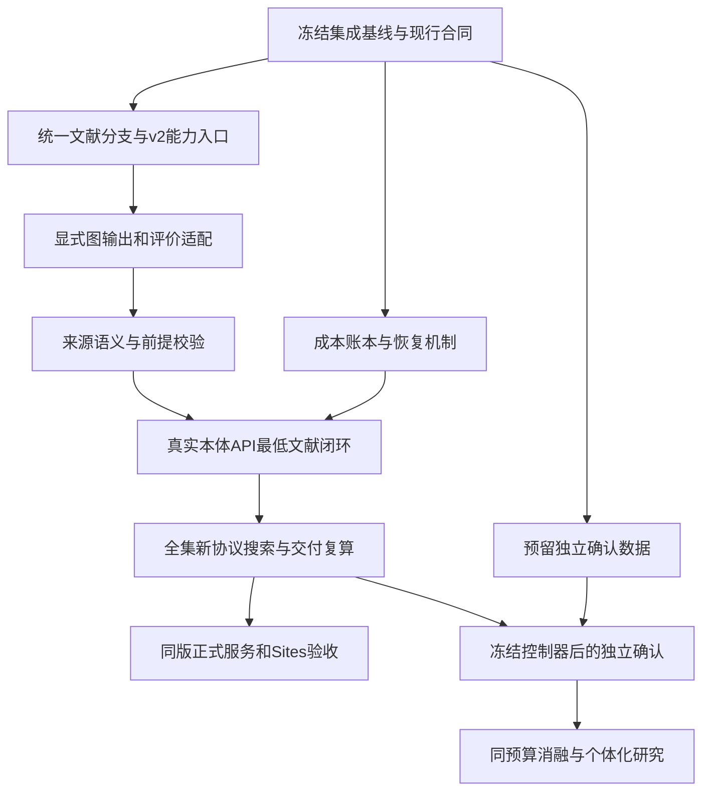

> 历史审计快照。2026-09-12 用户已撤回前沿性能及逐被试拟合/预处理目标；当前范围以 [实施状态](current-implementation-status.md) 为准。下文保留审计时记录，不代表当前待办。

# BrainAgent：跨对话现状、未解决问题与最终版本路线

审计日期：2026-09-12（Asia/Shanghai）。本次任务是整理现状与方案；没有更改业务代码、启动 EEG 探索、调用项目模型训练或更新部署。

**结论：项目已具备真实的六模块工作流、受约束搜索、EEGNet 三种子评价，以及全量图执行系统；最终正式版仍未完成。当前关键是把已经分别实现的能力连成同一条可验证的业务链，并证明其科学效用。**

## 1. 覆盖范围及判定方式

读取本机 BrainAgent 的 **19 个其他主对话、21 个历史子任务、48 份会话分段**，包含归档线程；检查全部 201 个本机会话文件的首条元数据，没有发现索引外的 BrainAgent 会话。提取并审阅用户需求、阶段结论、历史问题与后续修正，结合 42 篇 docs 顶层文档的缺口检索、关键代码和运行证据判定。完整来源索引见 [会话覆盖清单](sources/project-review-20260912/conversation-coverage.json)。

“全部”指上述本机可访问材料中识别到的全部未关闭事项，不承诺穷尽未知缺陷。另一个同名 ChatGPT 项目的本地镜像 sources 为空，当前没有云端聊天读取接口；未同步的云端对话不在本次覆盖内。历史工具输出和测试仅在支持具体结论时定向核查，没有重新执行全部实验。

优先级：P0 为近期正式版的关键阻塞；P1 为正式质量或明确能力所需的补齐；P2 为研究终局/扩展。另列一项旧框架归档待办。**60 项是去重后的问题、验证缺口和范围边界，不是60个已复现的软件故障，也不表示每项都是近期发布前提。** 状态明确区分部分实现、未实现、实测失败、尚未验证和待复核风险；“尚未验证”不推断为实现错误。

判定顺序：后续用户决定优先于早期草案；当前代码优先于旧说明；对应版本的实测优先于“已完成”措辞；未看到关闭证据就保留其适当状态。既有测试数字不跨版本相加，历史成绩不按新协议重算。

## 2. 最终目标与已经确定的约束

目标流程为：**数据调研 → 数据接入 → 本轮文献多分支拆解 → 基础/文献方法汇合 → 受约束生成和组合 → 实际执行与评价 → 按反馈继续探索 → 选择、解释和训练交付。** Agent 独立调用模型/API与数值工具，能够展示每一步的证据和仍未知之处。

- 当前主要用途是跨被试解码和训练数据效用；主指标固定为 EEGNet 种子17/42/2026各自的被试宏平均BA再等权平均，CSP-LDA仅为对照。25项信号质量和14项半合成重建另行解释。
- 默认扫描全部本地被试与Run；当前左右手MI评价只使用语义对应的R04/R08/R12。全Run接入不等于把其他任务混入二分类。
- 所有候选共用被试、Trial、划分、输出和训练条件；不能删困难对象、挑种子、缺失填零或事后改主指标。
- 文献真实参与不靠名称、预设配方或强制配额。来源方法可以不获胜，但必须真正执行、评价并影响后续决策。
- EN为基准维护双语；用户界面保留必要科学限制，移除开发过程口号和冗余。源码、报告产物和历史分别管理。
- Sites无需GPT登录、后端用当前电脑，是已经作出的选择；持久连接方案应在此基础上改进。
- 个体化预处理是研究终局方向：共享条件策略服务新人。它尚不是已实现产品，也不是本次整理自动启动新实验的指令。

早期“先随机选一个”“少量被试跑通”“六模型平均”“固定七起点”均不能继续定义正式业务。9月10日暂停旧探索后，9月11–12日又明确授权过针对新能力的实测；因此“所有真实调用一律暂停”也不是完整的最新状态。本轮只整理，未另开长实验。

## 3. 当前状态：按层看，不能合并成一个完成率

| 层级 | 已有证据 | 当前边界 |
|---|---|---|
| 六模块 | 真实调研、标准化、搜索、选择、报告、交付均有运行；Collection/Evaluation/Report/Delivery已不是旧占位 | 尚无当前全部整合修改的同版全集验收 |
| 调研 | 多来源/多用途检索、正文读取、证据保存和失败替代已实现；234项相关回归有历史记录 | 全文/反证充分性、供应商稳定性、动作账本仍有缺口 |
| 文献方法 | workflow已在候选池之前执行多分支拆解；参数来源、恢复、阻塞和谱系已落地 | workflow仍是14 op合同；独立库v2为88 op；两个入口未统一 |
| 图执行 | 本轮加载源码核实52单元/88 op/306 profile；306份收据文件哈希全部匹配 | 真实EEG覆盖11 profile；图尚不能进入旧固定EEGNet评分面板 |
| 自主文献闭环 | 定向论文方法在45共同Trial完成三轴；正式C/D各6候选有真实模型与数值 | 正式最低“实质文献处理参与”验收仍失败 |
| 评价 | EEGNet三种子+CSP、质量、重建、预测重算和完整性门禁 | 当前新协议全集与独立泛化确认未完成 |
| 神经先验 | 三态、10条条件规则、主动诊断、阶段/引用校验、ROI TFR已有实测 | 强保护测量、知识治理、解释语义和同预算消融未完 |
| 用户展示 | 图表稳定性、科研导出、跨图对比、减负、双语与离线展示已有实现和局部实测 | 新能力尚未在同一正式构建的完整业务页面验收 |
| 源码 | dev-xx，HEAD 5d6ebaca513f36029e24c5b3ed85aae0d4638c62；初查82个tracked修改、107个untracked状态条目 | HEAD不是当前工作树快照；不同冻结副本回归不能覆盖全部当前文件 |
| 本机服务 | 8000/8001健康200；5173、8900页面可读 | 两个业务后端的新增capabilities接口均404；缺构建身份 |
| Sites | 管理端本轮确认active/public、最新v3、2026-09-11更新 | 未包含9月12日全部新功能；普通HTTP探测403，须浏览器确认原因，不能推断需GPT登录 |

本轮只读证据：[服务/Git快照](../.local/project-review-20260912/snapshot.json)、[306份收据核对](../.local/project-review-20260912/receipt-check.json)、[Sites探测](../.local/project-review-20260912/sites-readonly-check.json)。收据哈希一致证明记录未变化；不等于本轮重跑数值算法或重新核验每个大型数组。

## 4. 历史成绩和验收为什么不能混用

| 运行 | 真实范围与结果 | 可支持的结论 |
|---|---|---|
| 9月9日工作流3ac37… | 六模块完成，离线HTML来自此轮 | 旧流程交付和展示，不是最新协议 |
| 搜索78b744… | 109人/327记录/4918Trial，旧CSP主分70.66%，导出重训预测一致 | 旧单模型全集协议下成功，不是EEGNet全集成绩 |
| 搜索b10fce… | 旧六模型协议仅完整评价参考，后续中断；38项重建另行重放修复 | 错误已修和历史开发分，不是完整搜索 |
| 神经先验3d6d5… | 4人/12记录/180Trial，单个开发被试45Trial；50.26%→53.75% | 两候选小面板工程闭环 |
| 文献定向验收 | 45共同Trial，轻量文献适配50.79%，基线50.00% | 文献方法可执行；不是自主调度成功 |
| 正式C | 4人、6候选，赢家62.12%；14文献源分支全阻塞 | 基础/工程派生跑通，文献参与失败 |
| 正式D：4f5b2b… | 4人/12记录/180Trial、四折LOSO、6候选；来源公共适配78.96% | 来源谱系进入比较；只有公共resample/epoch，严格最低文献验收失败 |
| v2全量单元 | 306 profile、188补充组合；真实两记录两配方共4输出 | 图适配与特定真实输入通过；不是306种真实方法效用比较 |

既有记录详见[正式整改](release-business-logic-review-20260912.md)、[全量图验收](sources/full-unit-integration-20260912/acceptance.md)、[文献实测](literature-method-validation-20260912.md)。D的mechanical_gate_passed曾误判，但acceptance_passed仍false；独立复核已否决机械结论，历史文件保留。

## 5. 60项问题台账

下列每项给出状态、影响、方案与验收。来源编号T指对话，C指本轮核对代码，D指项目文档，E指本轮观测；可点击到本机原材料。机器可读版本见[issues.json](sources/project-review-20260912/issues.json)。依赖是实施前提，允许先在有限合法子集贯通，不要求扩大数据权限或绕过现有拒绝。

### A. 文献、方法空间和执行主链

| 编号/状态 | 现状与影响 | 解决方案与关闭条件 |
|---|---|---|
| **I01 统一两种文献提取入口** P0 · 正式版 · 部分实现 | workflow 的 extraction_inputs() 仍调用默认 14 op 合同；独立 MethodLibrary 已可提供 88 op/306 profile。多分支提取、恢复与 v2 能力没有成为一个共同入口。 [T36](E:/work/BrainAgent/.local/project-review-20260912/36-01a09012-e2dc-7b62-aca5-bd0c0fa66869.json:1) [T37](E:/work/BrainAgent/.local/project-review-20260912/37-01a09013-8949-7900-9559-5978b7d9cf6d.json:1) [T40](E:/work/BrainAgent/.local/project-review-20260912/40-01a08e74-6627-7891-86c0-57260e819ff8.json:1) [C1](E:/work/BrainAgent/backend/app/preprocessing/literature.py:95) [C2](E:/work/BrainAgent/backend/app/preprocessing/methods.py:232) | 共享分支提取服务、目标合同和能力注册；两入口对同一来源输出一致的分支、参数出处、端口与阻塞原因，再通过真实模型实测。 依赖：I45 |
| **I02 v2 图进入统一 EEGNet 评价** P0 · 正式版 · 未实现 | literature_space 拒绝非 v1；recipe_compiler 明确拒绝把 unit_graph_v2 送入冻结面板。图可以执行，却不能参加正式三轴评价与统一选优。 [T36](E:/work/BrainAgent/.local/project-review-20260912/36-01a09012-e2dc-7b62-aca5-bd0c0fa66869.json:1) [T40](E:/work/BrainAgent/.local/project-review-20260912/40-01a08e74-6627-7891-86c0-57260e819ff8.json:1) [C3](E:/work/BrainAgent/backend/app/search/literature_space.py:34) [C4](E:/work/BrainAgent/backend/app/search/recipe_compiler.py:10) | 建立显式评价适配层：Trial/通道/时间/单位/参考/拟合域逐项对齐。只让符合当前协议的输出进入同一面板；CSD、删 Trial 等不兼容输出保留原因或另立协议。验证图到预测、分数和交付全链。 依赖：I01、I36 |
| **I03 实质文献方法自主参与闭环** P0 · 正式版 · 实测失败 | C 的 14 个源方法全阻塞；D 只执行公共 resample/epoch 的来源适配。7–30 Hz 和 60 Hz 陷波来源方案未调度；定向文献小测不等于自主成功。 [T37](E:/work/BrainAgent/.local/project-review-20260912/37-01a09013-8949-7900-9559-5978b7d9cf6d.json:1) [T40](E:/work/BrainAgent/.local/project-review-20260912/40-01a08e74-6627-7891-86c0-57260e819ff8.json:1) [D1](E:/work/BrainAgent/docs/release-business-logic-review-20260912.md:1) [D3](E:/work/BrainAgent/docs/literature-method-validation-20260912.md:1) | 事前冻结预算，从 fresh 调研经正式入口自然形成至少一个非预设、含实质来源处理操作的候选；真实三轴评价、影响后续动作、进入最终比较。无需获胜；不指定必跑论文、不加固定配额。 依赖：I01、I02、I05、I06、I07、I14、I32 |
| **I04 真实模型自主组合两类来源** P1 · 正式版 · 尚未验证 | 兼容片段组合及谱系已有实现/回归，尚无真实模型自主完成双来源组合并评价的充分证据。 [T37](E:/work/BrainAgent/.local/project-review-20260912/37-01a09013-8949-7900-9559-5978b7d9cf6d.json:1) [D3](E:/work/BrainAgent/docs/literature-method-validation-20260912.md:1) | 在自然形成的候选池中验证基础＋文献、文献＋文献组合；每个片段保留父方法、差异、拟合依赖和证据，编译、实际执行与评价一致。 依赖：I01、I02、I03 |
| **I05 参数和引文的语义核验** P0 · 正式版 · 部分实现 | 编号存在、引文出现在正文、JSON 合法不保证支持结论；已出现跨分支参数风险、工程值被误称作者值。 [T37](E:/work/BrainAgent/.local/project-review-20260912/37-01a09013-8949-7900-9559-5978b7d9cf6d.json:1) [T40](E:/work/BrainAgent/.local/project-review-20260912/40-01a08e74-6627-7891-86c0-57260e819ff8.json:1) [C1](E:/work/BrainAgent/backend/app/preprocessing/literature.py:95) [D1](E:/work/BrainAgent/docs/release-business-logic-review-20260912.md:1) | 建立参数值/单位/适用分支到原文跨度的校验记录；确定性规则检查可判定部分，独立复核处理语义；证据不足保持 unknown。错误单位、借用分支数值、默认值冒充原文必须被阻断或降为未证实假设。 依赖：I01 |
| **I06 前置条件由真实目标事实判定** P0 · 正式版 · 部分实现 | Prerequisite 的 satisfied 和 target_basis 仍有自然语言判断；部分算子检查确定性，但没有覆盖所有文献前提的事实谓词。 [T40](E:/work/BrainAgent/.local/project-review-20260912/40-01a08e74-6627-7891-86c0-57260e819ff8.json:1) [C1](E:/work/BrainAgent/backend/app/preprocessing/literature.py:95) [D1](E:/work/BrainAgent/docs/release-business-logic-review-20260912.md:1) | 为通道类型、坐标、事件、参考、分区、记录长度建立可执行谓词；数据不足为 unknown。构造虚假“有 EOG/有校准”时必须拒绝，不能仅信模型字符串。 依赖：I01 |
| **I07 缺口恢复真正解决来源和依赖** P1 · 正式版 · 部分实现 | 已实现定向补读、重新解析、显式仓库文件路径解析；复杂依赖、全文替代和适配仍受限，部分最新修复未走 fresh 全流程。 [T35](E:/work/BrainAgent/.local/project-review-20260912/35-01a08e5f-2409-7081-b286-14b1878cbfd8.json:1) [T37](E:/work/BrainAgent/.local/project-review-20260912/37-01a09013-8949-7900-9559-5978b7d9cf6d.json:1) [T40](E:/work/BrainAgent/.local/project-review-20260912/40-01a08e74-6627-7891-86c0-57260e819ff8.json:1) [D1](E:/work/BrainAgent/docs/release-business-logic-review-20260912.md:1) | 按具体缺口选择可审计动作，共享动作/时间账本；跟踪配置和依赖的固定版本。优先解决证据，仍未知则阻塞；记录有效修复率及失败原因，不猜科学参数。 依赖：I05、I06、I13、I14 |
| **I08 复杂窗口和多输出语义** P1 · 能力扩展 · 部分实现 | 已支持有限的最终 epoch 共同窗适配；依赖基线、筛查、拟合区间的窗口和多输出流尚未统一。 [T36](E:/work/BrainAgent/.local/project-review-20260912/36-01a09012-e2dc-7b62-aca5-bd0c0fa66869.json:1) [T40](E:/work/BrainAgent/.local/project-review-20260912/40-01a08e74-6627-7891-86c0-57260e819ff8.json:1) [D1](E:/work/BrainAgent/docs/release-business-logic-review-20260912.md:1) [D2](E:/work/BrainAgent/docs/preprocessing-integration-v2.md:1) | 源方法与工程适配分支分开；显式映射上下文窗、分析窗、评分窗与输出角色。不能把共同窗覆盖原始科学依赖；兼容性无法证明时保留不可比。 依赖：I02、I36 |
| **I09 完整经典流程库** P1 · 能力扩展 · 尚未验证 | 52 单元集成并不证明 PREP、RELAX、HAPPE、Automagic 等完整作者流程均已复现；已有部分完整组合验收。 [T04](E:/work/BrainAgent/.local/project-review-20260912/04-01a0704d-f524-7252-8434-2e9a506c61e9.json:1) [T36](E:/work/BrainAgent/.local/project-review-20260912/36-01a09012-e2dc-7b62-aca5-bd0c0fa66869.json:1) [D2](E:/work/BrainAgent/docs/preprocessing-integration-v2.md:1) [D10](E:/work/BrainAgent/docs/preprocessing-classic-methods-survey.md:1) | 以固定作者版本整理完整方法配方及适用条件；逐步核对所有必需操作、默认值、交互决定与输出。工程近似单独命名；完整原方法的声明须有整套数值与适用真实数据证据。 依赖：I01、I02 |

### B. 检索、恢复、上下文与预算

| 编号/状态 | 现状与影响 | 解决方案与关闭条件 |
|---|---|---|
| **I10 调研覆盖和停止依据** P1 · 正式版 · 部分实现 | 已覆盖本地/官方/论文核对与多用途检索，但做完必要尝试不等于充分召回；全文、反证及代码覆盖不齐。 [T04](E:/work/BrainAgent/.local/project-review-20260912/04-01a0704d-f524-7252-8434-2e9a506c61e9.json:1) [T06](E:/work/BrainAgent/.local/project-review-20260912/06-01a07ffa-4e85-74b3-ac0a-5ee3029c9926.json:1) [T35](E:/work/BrainAgent/.local/project-review-20260912/35-01a08e5f-2409-7081-b286-14b1878cbfd8.json:1) [T40](E:/work/BrainAgent/.local/project-review-20260912/40-01a08e74-6627-7891-86c0-57260e819ff8.json:1) [D4](E:/work/BrainAgent/docs/literature-retrieval-audit.md:1) [D5](E:/work/BrainAgent/docs/neural-prior-gap-analysis.md:61) | 维护问题×资料类型覆盖表、去重来源、补充材料和引用追踪；用新增有效证据与尚存问题决定继续/停止，逐项保存未覆盖原因，不用篇数证明全面。 依赖：I12、I13 |
| **I11 证据质量分级** P1 · 正式版 · 部分实现 | 已有定位、来源哈希与纳入理由，研究设计质量、复现偏差、适用人群和冲突证据尚未形成完整可查询评价。 [T04](E:/work/BrainAgent/.local/project-review-20260912/04-01a0704d-f524-7252-8434-2e9a506c61e9.json:1) [T40](E:/work/BrainAgent/.local/project-review-20260912/40-01a08e74-6627-7891-86c0-57260e819ff8.json:1) [D1](E:/work/BrainAgent/docs/release-business-logic-review-20260912.md:1) [D5](E:/work/BrainAgent/docs/neural-prior-gap-analysis.md:61) | 形成 claim-evidence 记录，区分全文方法、摘要、仓库 README、作者代码、项目推断；参数和神经结论分别设置证据要求，不能以引用量/星数代替相关性。 依赖：I05、I10 |
| **I12 检索供应商实际可用性** P1 · 正式版 · 部分实现 | 真实调用部分匿名源遭限流；Europe PMC/Crossref 已成功；Unpaywall 真实请求尚未验收，不能把样例回归当联网成功。 [T35](E:/work/BrainAgent/.local/project-review-20260912/35-01a08e5f-2409-7081-b286-14b1878cbfd8.json:1) [D4](E:/work/BrainAgent/docs/literature-retrieval-audit.md:1) | 按供应商记录可用性、退避、缓存、缺失配置和替代来源；完成实际配置下的失败转移与正文获取验收，保留低相关结果筛选。 依赖：无 |
| **I13 检索中断的预算及幂等恢复** P1 · 正式版 · 待复核风险 | 历史子任务复现过预算重置与重复成功查询。当前 retrieve 仍从 remaining=budget 开始；筛选失败跳过重复检索已有修复，但检索中途崩溃后的全局计费与幂等未充分证明。 [T08](E:/work/BrainAgent/.local/project-review-20260912/08-01a08519-f299-74f1-8632-1130407af672.json:1) [C5](E:/work/BrainAgent/backend/app/workflows/survey_research.py:110) | 用持久化 action_id、累计花费和 deadline 约束恢复；在工具已返回而保存未完成等节点注入故障。确认重试不免费恢复预算、不重复记成功；本项是代码风险，非本轮新实测故障。 依赖：无 |
| **I14 上下文、调用成本和搜索调度** P0 · 正式版 · 部分实现 | 历史决策输入曾达 249230 tokens；已压缩重复恢复日志。全集、88 op 合同及长历史仍无全局上下文保证；候选信息价值/成本与停止判断主要依赖模型文字。 [T08](E:/work/BrainAgent/.local/project-review-20260912/08-01a08519-f299-74f1-8632-1130407af672.json:1) [T37](E:/work/BrainAgent/.local/project-review-20260912/37-01a09013-8949-7900-9559-5978b7d9cf6d.json:1) [T40](E:/work/BrainAgent/.local/project-review-20260912/40-01a08e74-6627-7891-86c0-57260e819ff8.json:1) [D1](E:/work/BrainAgent/docs/release-business-logic-review-20260912.md:1) | 分层摘要＋按需原证据读取；逐调用记录 token/时延/成本并预留输出，持久化总预算。用有效新证据、候选差异、真实成本及未执行理由校准调度，保持完整分数账本，不固定方法比例。 依赖：I10、I13、I32 |

### C. 神经先验、诊断与可信解释

| 编号/状态 | 现状与影响 | 解决方案与关闭条件 |
|---|---|---|
| **I15 神经先验研究覆盖** P1 · 研究终局 · 部分实现 | 既有知识 43 来源、25 操作类、300 对关系中仍有 130 对 gap；11 解读议题和精选规则不代表穷尽先验。 [T40](E:/work/BrainAgent/.local/project-review-20260912/40-01a08e74-6627-7891-86c0-57260e819ff8.json:1) [D5](E:/work/BrainAgent/docs/neural-prior-gap-analysis.md:61) [D6](E:/work/BrainAgent/docs/neural-prior-implementation-review.md:1) | 按任务、污染、算子、损伤与失效条件建立研究议题队列；补参数、反证和边界，允许不可解决 gap，发布覆盖与停止理由。 依赖：I10、I11 |
| **I16 研究规则统一编译和应用** P1 · 研究终局 · 部分实现 | 研究目录有 68 条规则，第一轮神经包落地 10 条条件规则；三态执行已具备，尚未覆盖所有可操作研究规则。 [T40](E:/work/BrainAgent/.local/project-review-20260912/40-01a08e74-6627-7891-86c0-57260e819ff8.json:1) [D5](E:/work/BrainAgent/docs/neural-prior-gap-analysis.md:61) [D6](E:/work/BrainAgent/docs/neural-prior-implementation-review.md:1) | 统一规则类型、触发事实、作用域和结果回执；纯解释规则保持 advisory，不把全部文献意见硬化。核对每个可执行规则的命中/未命中/未知与真实动作。 依赖：I06、I15 |
| **I17 规则冲突与例外** P1 · 研究终局 · 部分实现 | 已有硬软区分、冲突文本和挑战记录，缺跨规则优先适用、例外及冲突集的完整处理。 [T40](E:/work/BrainAgent/.local/project-review-20260912/40-01a08e74-6627-7891-86c0-57260e819ff8.json:1) [D5](E:/work/BrainAgent/docs/neural-prior-gap-analysis.md:61) | 以任务/单位/阶段/数据权限确定适用域；硬条件优先，经验冲突触发诊断或明确保留。针对互相矛盾的规则验证结果和用户说明。 依赖：I16 |
| **I18 知识更新、失效和撤销** P1 · 研究终局 · 未完成 | 来源与运行可冻结；更新、勘误、撤稿、作者依赖变化没有形成新运行影响分析闭环。 [T40](E:/work/BrainAgent/.local/project-review-20260912/40-01a08e74-6627-7891-86c0-57260e819ff8.json:1) [D5](E:/work/BrainAgent/docs/neural-prior-gap-analysis.md:61) [D6](E:/work/BrainAgent/docs/neural-prior-implementation-review.md:1) | 版本化知识状态与变更日志，失效来源影响新配方与新运行；历史只读保留原依据，记录重评范围与撤销原因。 依赖：I11、I16 |
| **I19 动态诊断的能力范围** P1 · 研究终局 · 部分实现 | request_diagnostic 已真实执行；主要分析已有测量/画像，尚非可按假设启动任意已注册新数值诊断的统一系统。 [T12](E:/work/BrainAgent/.local/project-review-20260912/12-01a08535-7ef9-7552-bb78-3a1369b9a9d4.json:1) [T40](E:/work/BrainAgent/.local/project-review-20260912/40-01a08e74-6627-7891-86c0-57260e819ff8.json:1) [D6](E:/work/BrainAgent/docs/neural-prior-implementation-review.md:1) | 为新诊断注册输入域、标签权限、成本、数值合同和产物；让模型按竞争假设选择，有预算地执行并改变下一步动作。 依赖：I02、I14、I16 |
| **I20 强神经保护测量** P1 · 研究终局 · 部分实现 | 已有 ROI TFR、μ/β 与 Welch ERDS，尚缺完整个体峰频、周期/非周期分离、时序失真、侧化与移除信号保护证据。 [T34](E:/work/BrainAgent/.local/project-review-20260912/34-01a08c77-1e12-7513-b1e7-a87ada01c5ed.json:1) [T40](E:/work/BrainAgent/.local/project-review-20260912/40-01a08e74-6627-7891-86c0-57260e819ff8.json:1) [D5](E:/work/BrainAgent/docs/neural-prior-gap-analysis.md:61) [D6](E:/work/BrainAgent/docs/neural-prior-implementation-review.md:1) | 逐项实现适用性和有效时间支持，保留基线/分母/不确定性；先做已知信号验证，再做真实 EEG。不能以“典型 ERD”作为必须制造的形态。 依赖：I19、I21、I25 |
| **I21 物理视图、适配视图及移除信号对照** P1 · 研究终局 · 部分实现 | 已区分 EA 前后阶段并做配对可比性检查；通用图的原生视图/共同视图/被移除成分尚未贯通全部比较。 [T36](E:/work/BrainAgent/.local/project-review-20260912/36-01a09012-e2dc-7b62-aca5-bd0c0fa66869.json:1) [T38](E:/work/BrainAgent/.local/project-review-20260912/38-01a09013-dff1-7322-b7fc-253282f005ca.json:1) [T40](E:/work/BrainAgent/.local/project-review-20260912/40-01a08e74-6627-7891-86c0-57260e819ff8.json:1) [D2](E:/work/BrainAgent/docs/preprocessing-integration-v2.md:1) [D5](E:/work/BrainAgent/docs/neural-prior-gap-analysis.md:61) [D6](E:/work/BrainAgent/docs/neural-prior-implementation-review.md:1) | 统一比较合同与视图来源；同步同片段前后及残差，说明参考、单位、频带变化；不可比时不制造配对差或相关性。 依赖：I02、I36 |
| **I22 运行中复核与局部回退** P1 · 研究终局 · 部分实现 | 已有失败、条件 ASR、人工待决定及重试；缺每步观测→复核规则→影子分支→受约束回退的通用闭环。 [T12](E:/work/BrainAgent/.local/project-review-20260912/12-01a08535-7ef9-7552-bb78-3a1369b9a9d4.json:1) [T36](E:/work/BrainAgent/.local/project-review-20260912/36-01a09012-e2dc-7b62-aca5-bd0c0fa66869.json:1) [T40](E:/work/BrainAgent/.local/project-review-20260912/40-01a08e74-6627-7891-86c0-57260e819ff8.json:1) [D2](E:/work/BrainAgent/docs/preprocessing-integration-v2.md:1) [D5](E:/work/BrainAgent/docs/neural-prior-gap-analysis.md:61) | 保存步骤后条件和不可变检查点，显式重编译局部替代分支；原失败和决定不改写，回退本身也须验证适用性。 依赖：I19、I21、I36 |
| **I23 解释语义的忠实性** P0 · 正式版 · 部分实现 | 结构和阶段校验已增强，但真实模型仍出现总方差推出低频主导、条件数饱和被错误归因等问题；少量模型复核不等于专家确认。 [T38](E:/work/BrainAgent/.local/project-review-20260912/38-01a09013-dff1-7322-b7fc-253282f005ca.json:1) [T40](E:/work/BrainAgent/.local/project-review-20260912/40-01a08e74-6627-7891-86c0-57260e819ff8.json:1) [D1](E:/work/BrainAgent/docs/release-business-logic-review-20260912.md:1) [D6](E:/work/BrainAgent/docs/neural-prior-implementation-review.md:1) | 把可核实事实、允许推断、竞争假设、待测预测分开；确定性差异表作为输入，建立真实回复样本和反事实审阅。无频率证据的归因须拒绝或明确保留假设。 依赖：I05、I06、I21 |
| **I24 效用、质量、神经保护的结论合同** P0 · 正式版 · 部分实现 | EEGNet 唯一选优和三轴分离已实现；“完成评价/质量合格/神经信息保留/泛化改善”仍需统一到目标和发布结论合同。 [T06](E:/work/BrainAgent/.local/project-review-20260912/06-01a07ffa-4e85-74b3-ac0a-5ee3029c9926.json:1) [T12](E:/work/BrainAgent/.local/project-review-20260912/12-01a08535-7ef9-7552-bb78-3a1369b9a9d4.json:1) [T26](E:/work/BrainAgent/.local/project-review-20260912/26-01a0899a-a541-7392-a70a-47fa53d2f0aa.json:1) [T40](E:/work/BrainAgent/.local/project-review-20260912/40-01a08e74-6627-7891-86c0-57260e819ff8.json:1) [D1](E:/work/BrainAgent/docs/release-business-logic-review-20260912.md:1) [D5](E:/work/BrainAgent/docs/neural-prior-gap-analysis.md:61) | 保持当前三种子 BA 选优，缺失不填零；单独输出各类结论资格及证据限制。若未来以保护量约束选优，另立事前冻结协议，不事后加权。 依赖：I23 |

### D. 科学评价及独立证据

| 编号/状态 | 现状与影响 | 解决方案与关闭条件 |
|---|---|---|
| **I25 半合成重建的科学验证** P1 · 研究终局 · 部分实现 | 14 项指标与负对照已有；cleanproxy 来自真实 EEG，不是纯净神经真值，当前每被试固定探针也不是全部记录重建。 [T12](E:/work/BrainAgent/.local/project-review-20260912/12-01a08535-7ef9-7552-bb78-3a1369b9a9d4.json:1) [T26](E:/work/BrainAgent/.local/project-review-20260912/26-01a0899a-a541-7392-a70a-47fa53d2f0aa.json:1) [T40](E:/work/BrainAgent/.local/project-review-20260912/40-01a08e74-6627-7891-86c0-57260e819ff8.json:1) [D5](E:/work/BrainAgent/docs/neural-prior-gap-analysis.md:61) [D6](E:/work/BrainAgent/docs/neural-prior-implementation-review.md:1) | 增加已知神经源仿真、真实伪迹模板、真实数据三轨；报告移除与保留、参数敏感性和适用范围，不能用重建成功宣称生理无损。 依赖：I21 |
| **I26 方法鲁棒性与不确定性** P1 · 研究终局 · 未充分验证 | 已有被试/种子分布和局部对照，缺跨污染强度、参数、任务、人群的统一适用范围画像。 [T12](E:/work/BrainAgent/.local/project-review-20260912/12-01a08535-7ef9-7552-bb78-3a1369b9a9d4.json:1) [T40](E:/work/BrainAgent/.local/project-review-20260912/40-01a08e74-6627-7891-86c0-57260e819ff8.json:1) [D5](E:/work/BrainAgent/docs/neural-prior-gap-analysis.md:61) | 以配对被试差、置信区间、失败率、成本及预测覆盖汇总；预先确定敏感性分析，分别报告种子波动和个体差异。 依赖：I27、I28 |
| **I27 新协议全集搜索** P0 · 正式版 · 未完成 | 109 人、327 目标记录、4918 Trial 已有源一致性/清理证据；尚无当前 EEGNet 三种子＋实质文献主链的完整全集搜索。 [T06](E:/work/BrainAgent/.local/project-review-20260912/06-01a07ffa-4e85-74b3-ac0a-5ee3029c9926.json:1) [T31](E:/work/BrainAgent/.local/project-review-20260912/31-01a08a5f-0389-7c13-be0c-90ec66392ea1.json:1) [T40](E:/work/BrainAgent/.local/project-review-20260912/40-01a08e74-6627-7891-86c0-57260e819ff8.json:1) [D1](E:/work/BrainAgent/docs/release-business-logic-review-20260912.md:1) [D7](E:/work/BrainAgent/docs/offline-search-acceptance.md:1) | 先测全集单候选成本，冻结共同范围、分组外折、种子和预算，再新建完整搜索；保留所有排除/失败，不能续写旧 b10 成绩。 依赖：I03、I32、I45 |
| **I28 独立泛化确认** P0 · 正式版 · 未完成 | 开发分数被反复用于选择，且既往已查看全部 EEGMMIDB 被试；简单重新切分不能抹去既有开发信息。 [T12](E:/work/BrainAgent/.local/project-review-20260912/12-01a08535-7ef9-7552-bb78-3a1369b9a9d4.json:1) [T17](E:/work/BrainAgent/.local/project-review-20260912/17-01a085ef-db84-7e82-abab-07488f3ca386.json:1) [T40](E:/work/BrainAgent/.local/project-review-20260912/40-01a08e74-6627-7891-86c0-57260e819ff8.json:1) [D5](E:/work/BrainAgent/docs/neural-prior-gap-analysis.md:61) [D7](E:/work/BrainAgent/docs/offline-search-acceptance.md:1) | 在进一步开发前登记未参与开发的外部数据/未来记录与适配权限，冻结完整控制器后确认；新确认结果不回流同一轮改规则。无新数据时明确只报告开发结果。 依赖：I24、I27 |
| **I29 自动探索及先验本身是否有价值** P1 · 研究终局 · 未完成 | random/exhaustive/one_shot 对照入口已有，尚无同预算真实实验表明完整 Agent 比静态/无先验方法更好。 [T12](E:/work/BrainAgent/.local/project-review-20260912/12-01a08535-7ef9-7552-bb78-3a1369b9a9d4.json:1) [T40](E:/work/BrainAgent/.local/project-review-20260912/40-01a08e74-6627-7891-86c0-57260e819ff8.json:1) [D5](E:/work/BrainAgent/docs/neural-prior-gap-analysis.md:61) [D6](E:/work/BrainAgent/docs/neural-prior-implementation-review.md:1) | 比较无先验、静态先验、动态诊断、完整系统，并保留随机/一次提案基线；用相同信息与计算预算衡量最终效用、有效修复、重复率和成本。 依赖：I27、I28、I32 |
| **I30 接近领域前沿的性能目标** P1 · 研究终局 · 未完成 | 旧 CSP 70.66%、D 四被试 78.96% 均不能作为当前协议 SOTA 证据；完全可比的强结果尚未确立。 [T06](E:/work/BrainAgent/.local/project-review-20260912/06-01a07ffa-4e85-74b3-ac0a-5ee3029c9926.json:1) [T21](E:/work/BrainAgent/.local/project-review-20260912/21-01a08718-571f-7e53-a0a8-6a981c9dbbfa.json:1) [D7](E:/work/BrainAgent/docs/offline-search-acceptance.md:1) | 建立任务/被试/Run/切窗/标签权限/划分/指标对照表，选可复现方法在同协议重跑；报告差距，研究目标不承诺达标。 依赖：I27、I28、I31 |
| **I31 预处理收益与学习器收益分离** P1 · 研究终局 · 未充分验证 | EEGNet 主、CSP-LDA 对照已落地；真实全规模收益是否跨学习器稳定尚未证明。 [T06](E:/work/BrainAgent/.local/project-review-20260912/06-01a07ffa-4e85-74b3-ac0a-5ee3029c9926.json:1) [T12](E:/work/BrainAgent/.local/project-review-20260912/12-01a08535-7ef9-7552-bb78-3a1369b9a9d4.json:1) [T26](E:/work/BrainAgent/.local/project-review-20260912/26-01a0899a-a541-7392-a70a-47fa53d2f0aa.json:1) [D7](E:/work/BrainAgent/docs/offline-search-acceptance.md:1) | 保持正式两模型协议；独立分析固定学习器的处理前后配对差与源端/目标端干预，必要扩展仅作为明确额外实验，不恢复旧六模型加权主分。 依赖：I27、I28 |

### E. 执行语义、资源与数值验证

| 编号/状态 | 现状与影响 | 解决方案与关闭条件 |
|---|---|---|
| **I32 全集资源与耗时实测** P0 · 正式版 · 未充分验证 | 小面板成本已有；全集每候选五折×三种子共 15 次 EEGNet 训练及质量/重建、图存储成本未实测。旧运行发现明显 I/O 等待，具体原因未确认。 [T06](E:/work/BrainAgent/.local/project-review-20260912/06-01a07ffa-4e85-74b3-ac0a-5ee3029c9926.json:1) [T08](E:/work/BrainAgent/.local/project-review-20260912/08-01a08519-f299-74f1-8632-1130407af672.json:1) [T15](E:/work/BrainAgent/.local/project-review-20260912/15-01a08595-b4a8-72f0-acee-c90da8a306c1.json:1) [T23](E:/work/BrainAgent/.local/project-review-20260912/23-01a08718-eabe-7590-8943-7c961987a230.json:1) [D1](E:/work/BrainAgent/docs/release-business-logic-review-20260912.md:1) [D7](E:/work/BrainAgent/docs/offline-search-acceptance.md:1) | 记录完整候选阶段 wall/CPU、峰值进程树内存、磁盘增长与 I/O 等待，按实测选择并发和预算。估算须给范围；资源不够应停止，不能削种子/被试凑完成。 依赖：I45 |
| **I33 整合后的恢复、并发和长任务生命周期** P1 · 正式版 · 待系统验收 | 已有 Worker/进程树取消与断点保护；新图、旧搜索、两个后端及历史 running 状态尚无同版系统恢复验收。 [T08](E:/work/BrainAgent/.local/project-review-20260912/08-01a08519-f299-74f1-8632-1130407af672.json:1) [T15](E:/work/BrainAgent/.local/project-review-20260912/15-01a08595-b4a8-72f0-acee-c90da8a306c1.json:1) [T36](E:/work/BrainAgent/.local/project-review-20260912/36-01a09012-e2dc-7b62-aca5-bd0c0fa66869.json:1) [T39](E:/work/BrainAgent/.local/project-review-20260912/39-01a0908d-c484-72f0-b987-bdf1f25ed3be.json:1) [T40](E:/work/BrainAgent/.local/project-review-20260912/40-01a08e74-6627-7891-86c0-57260e819ff8.json:1) [D2](E:/work/BrainAgent/docs/preprocessing-integration-v2.md:1) [D8](E:/work/BrainAgent/docs/sites-deployment.md:1) | 先核对任务与进程身份，再验证崩溃恢复、资源耗尽、断网、并发隔离与终态发布；已完成产物验证后复用，不能把状态文件 running 当作活进程。 依赖：I13、I37、I45 |
| **I34 v2 逐被试无标签拟合** P1 · 能力扩展 · 未实现 | v1 EA 已支持逐被试变换；v2 来源批处理拟合器明确拒绝 subject_unlabeled，不能互相替代证明。 [T17](E:/work/BrainAgent/.local/project-review-20260912/17-01a085ef-db84-7e82-abab-07488f3ca386.json:1) [T36](E:/work/BrainAgent/.local/project-review-20260912/36-01a09012-e2dc-7b62-aca5-bd0c0fa66869.json:1) [D2](E:/work/BrainAgent/docs/preprocessing-integration-v2.md:1) | 增加按被试跨记录的拟合数据集/状态合同、变换绑定和应用规则；实际核验读取范围与模型复用，清楚标记转导协议。 依赖：I02、I36 |
| **I35 在线处理和拟合** P2 · 研究终局 · 未实现 | v2 当前拒绝 online；整批 EA/记录拟合不能声称在线能力。 [T12](E:/work/BrainAgent/.local/project-review-20260912/12-01a08535-7ef9-7552-bb78-3a1369b9a9d4.json:1) [T17](E:/work/BrainAgent/.local/project-review-20260912/17-01a085ef-db84-7e82-abab-07488f3ca386.json:1) [T36](E:/work/BrainAgent/.local/project-review-20260912/36-01a09012-e2dc-7b62-aca5-bd0c0fa66869.json:1) [D2](E:/work/BrainAgent/docs/preprocessing-integration-v2.md:1) | 另立时间顺序协议，记录到达时刻、先预测后更新规则、滤波延迟与持久状态；逐时刻模拟并验证不读取未来数据。 依赖：I34、I36、I53 |
| **I36 状态化分区拟合图** P0 · 正式版 · 部分实现 | train/calibration 重放只支持不依赖模型、决定或外部参数端口的确定性前处理；复杂清理后再拟合仍受限。 [T36](E:/work/BrainAgent/.local/project-review-20260912/36-01a09012-e2dc-7b62-aca5-bd0c0fa66869.json:1) [T40](E:/work/BrainAgent/.local/project-review-20260912/40-01a08e74-6627-7891-86c0-57260e819ff8.json:1) [D2](E:/work/BrainAgent/docs/preprocessing-integration-v2.md:1) | 将每个拟合节点依赖与合法视图显式入图，先分区再重放可用依赖；对修改测试区间而训练模型应不变的故障用例验证泄漏边界。不支持组合继续拒绝。 依赖：I45 |
| **I37 原生算法即时取消** P1 · 正式版 · 部分实现 | 图取消在步骤边界生效，长时间作者调用仅靠自身 timeout；已有搜索进程树控制不等于每个 v2 原生调用可立即停止。 [T15](E:/work/BrainAgent/.local/project-review-20260912/15-01a08595-b4a8-72f0-acee-c90da8a306c1.json:1) [T36](E:/work/BrainAgent/.local/project-review-20260912/36-01a09012-e2dc-7b62-aca5-bd0c0fa66869.json:1) [D2](E:/work/BrainAgent/docs/preprocessing-integration-v2.md:1) | 隔离原生调用并接入任务取消/超时与后代回收，保存部分产物状态；验证不产生孤儿进程、不把中断写为完成。 依赖：I45 |
| **I38 真实 EEG 的 profile 覆盖** P1 · 能力扩展 · 尚未验证 | 306 个 profile 有运行与来源一致性证据，真实 EEG 只覆盖 11 个，尚有 295 个无真实数据验收。 [T36](E:/work/BrainAgent/.local/project-review-20260912/36-01a09012-e2dc-7b62-aca5-bd0c0fa66869.json:1) [D2](E:/work/BrainAgent/docs/preprocessing-integration-v2.md:1) [E2](E:/work/BrainAgent/.local/project-review-20260912/receipt-check.json:1) | 按 EOG/ECG/几何/资产/任务适用性建立代表性数据矩阵，逐类验证；不强迫 EEGMMIDB 验证无 EOG 方法，也不要求无限连续参数笛卡尔积。 依赖：I09、I40、I58 |
| **I39 超越“与同一来源一致”的算法正确性** P1 · 研究终局 · 尚未验证 | 306 项主要比较固定来源函数与图适配器；证明适配一致，不等于独立算法正确性或所有作者论文结果复现。 [T36](E:/work/BrainAgent/.local/project-review-20260912/36-01a09012-e2dc-7b62-aca5-bd0c0fa66869.json:1) [D2](E:/work/BrainAgent/docs/preprocessing-integration-v2.md:1) [E2](E:/work/BrainAgent/.local/project-review-20260912/receipt-check.json:1) | 按高风险方法增加解析信号、独立参考、公开基准或作者测试；区分适配器一致、算法行为、论文效果三种证据。 依赖：I09、I38 |

### F. 数据接入及训练交付

| 编号/状态 | 现状与影响 | 解决方案与关闭条件 |
|---|---|---|
| **I40 数据事实与缺失检查器** P1 · 正式版 · 部分实现 | 当前仍缺通用 BIDS 根发现、WFDB event 对照、完整设备/接地/人口学/行为等本地提取；模板坐标不等于个体实测坐标。 [T04](E:/work/BrainAgent/.local/project-review-20260912/04-01a0704d-f524-7252-8434-2e9a506c61e9.json:1) [T06](E:/work/BrainAgent/.local/project-review-20260912/06-01a07ffa-4e85-74b3-ac0a-5ee3029c9926.json:1) [D9](E:/work/BrainAgent/docs/data-collection-review.md:1) [C6](E:/work/BrainAgent/backend/app/workflows/local_observation.py:270) | 按本地可获得文件实现对应只读检查器，关联官方资料；没有数据保持 unknown/not_checked，并明确哪些缺失会阻止哪些方法，不让报告自动补全。 依赖：I10、I06 |
| **I41 完整官方 BIDS Validator** P1 · 正式版 · 未完成 | 当前合同 official_validator 只能取 not_run；MNE-BIDS 写入与逐点往返校验不能替代完整标准验证。 [T04](E:/work/BrainAgent/.local/project-review-20260912/04-01a0704d-f524-7252-8434-2e9a506c61e9.json:1) [D9](E:/work/BrainAgent/docs/data-collection-review.md:1) [C7](E:/work/BrainAgent/backend/app/workflows/collection_contracts.py:126) | 固定 Validator/规范版本，对新标准化产物运行并保存 JSON 回执；区分错误与有理由保留的警告，核对单位、元数据、事件与数值回读。 依赖：I40、I45 |
| **I42 科学排除规则与对象证据** P1 · 正式版 · 部分实现 | 结构性失败排除、前后统计和文献对象匹配已实现；文献建议不自动排除，部分来源对象无法定位，科学质量排除策略未最终确认。 [T04](E:/work/BrainAgent/.local/project-review-20260912/04-01a0704d-f524-7252-8434-2e9a506c61e9.json:1) [T06](E:/work/BrainAgent/.local/project-review-20260912/06-01a07ffa-4e85-74b3-ac0a-5ee3029c9926.json:1) [D9](E:/work/BrainAgent/docs/data-collection-review.md:1) | 以可定位来源和本地对象制定事前冻结的共同规则；保留 flag 与排除理由、pre/post/Delta。禁止因开发分数差而删除困难对象，也不沿用早期“宁可错杀”作无条件规则。 依赖：I05、I06、I40 |
| **I43 当前最终赢家的正式训练交付** P0 · 正式版 · 尚未验证 | 旧全集 CSP 交付与小型 EEGNet 重载已验证；当前整合版文献/图搜索赢家的全集 X/y、模型、推理与下载包尚未完整验收。 [T18](E:/work/BrainAgent/.local/project-review-20260912/18-01a0861d-ba8a-7d90-b9bc-fcde6e9d313e.json:1) [T30](E:/work/BrainAgent/.local/project-review-20260912/30-01a08a44-79b7-7ec1-a348-dde238736e2e.json:1) [T31](E:/work/BrainAgent/.local/project-review-20260912/31-01a08a5f-0389-7c13-be0c-90ec66392ea1.json:1) [T40](E:/work/BrainAgent/.local/project-review-20260912/40-01a08e74-6627-7891-86c0-57260e819ff8.json:1) [D7](E:/work/BrainAgent/docs/offline-search-acceptance.md:1) | 最终选择后独立逐 Trial 核对评分数组、变换和导出数组，重载模型复算预测/主分，核对 ZIP/manifest/hash 与可运行训练说明；注明开发折身份，不伪造独立测试集。 依赖：I02、I03、I27、I45 |
| **I44 跨层产物的统一严格合同** P1 · 正式版 · 部分实现 | 已有固定 JSON/TSV 模板和 v2 封闭 codec；底层异构诊断 payload 尚未全部形成各消费者共享的严格语义模型。 [T06](E:/work/BrainAgent/.local/project-review-20260912/06-01a07ffa-4e85-74b3-ac0a-5ee3029c9926.json:1) [T36](E:/work/BrainAgent/.local/project-review-20260912/36-01a09012-e2dc-7b62-aca5-bd0c0fa66869.json:1) [D2](E:/work/BrainAgent/docs/preprocessing-integration-v2.md:1) [D11](E:/work/BrainAgent/docs/artifact-formats.md:1) | 按数据/模型/诊断/决定/评分输出定义版本化 schema，覆盖生产者、API、报告、前端与迁移；对未知字段、单位/轴失配、旧版本读取做一致性检查。 依赖：I02、I21 |

### G. 版本、运行服务、界面和部署

| 编号/状态 | 现状与影响 | 解决方案与关闭条件 |
|---|---|---|
| **I45 统一源码及可复现发布版本** P0 · 正式版 · 未完成 | 本轮初查 HEAD=5d6ebac、dev-xx；82 个 tracked 修改＋107 个 untracked 状态条目。各方向测试对应不同冻结副本，不能相加声称当前整树通过。 [T34](E:/work/BrainAgent/.local/project-review-20260912/34-01a08c77-1e12-7513-b1e7-a87ada01c5ed.json:1) [T36](E:/work/BrainAgent/.local/project-review-20260912/36-01a09012-e2dc-7b62-aca5-bd0c0fa66869.json:1) [T37](E:/work/BrainAgent/.local/project-review-20260912/37-01a09013-8949-7900-9559-5978b7d9cf6d.json:1) [T40](E:/work/BrainAgent/.local/project-review-20260912/40-01a08e74-6627-7891-86c0-57260e819ff8.json:1) [E1](E:/work/BrainAgent/.local/project-review-20260912/snapshot.json:1) | 保留所有现有工作，按文件归属整合为同一候选提交，冻结源码/依赖/模板/模型配置与资产哈希；跑相称的全链回归，按项目约定提交推送，输出一个可复现发布清单。 依赖：无 |
| **I46 运行服务未加载新能力** P0 · 正式版 · 实测未接入 | 本轮 8000、8001 /health 均 200；两者 /api/preprocessing/capabilities 均 404。5173 与8900可访问；预览成功不代表业务服务有新代码。 [T36](E:/work/BrainAgent/.local/project-review-20260912/36-01a09012-e2dc-7b62-aca5-bd0c0fa66869.json:1) [T39](E:/work/BrainAgent/.local/project-review-20260912/39-01a0908d-c484-72f0-b987-bdf1f25ed3be.json:1) [T40](E:/work/BrainAgent/.local/project-review-20260912/40-01a08e74-6627-7891-86c0-57260e819ff8.json:1) [E1](E:/work/BrainAgent/.local/project-review-20260912/snapshot.json:1) | 核对并保护现有任务后，以同一冻结构建更新 API/数值 Worker/前端，增加 build-info；从实际服务验证版本、能力目录、提交/取消/下载和报告。 依赖：I45、I33 |
| **I47 正式界面的完整决策链** P1 · 正式版 · 尚未验证 | 图表和解读在独立真实数据实例已多轮验证；统一发布工作流、图候选与全部来源/失败状态尚无同版浏览器验收。 [T34](E:/work/BrainAgent/.local/project-review-20260912/34-01a08c77-1e12-7513-b1e7-a87ada01c5ed.json:1) [T38](E:/work/BrainAgent/.local/project-review-20260912/38-01a09013-dff1-7322-b7fc-253282f005ca.json:1) [T40](E:/work/BrainAgent/.local/project-review-20260912/40-01a08e74-6627-7891-86c0-57260e819ff8.json:1) [D1](E:/work/BrainAgent/docs/release-business-logic-review-20260912.md:1) [D12](E:/work/BrainAgent/docs/figure-audit-20260912.md:1) | 在正式服务逐项走来源→分支→配方→决定→执行→三轴→赢家→包，覆盖失败/缺失/等待决定、窄屏、双语和下载；字段必须与账本一致。 依赖：I02、I23、I43、I46 |
| **I48 文档、双语和状态口径同步** P1 · 正式版 · 部分实现 | EN 基准双语已实现；旧交接仍写七起点、旧白名单和暂停状态，部分新文档写261而最终已306；历史材料与现行说明混读风险存在。 [T32](E:/work/BrainAgent/.local/project-review-20260912/32-01a08c6f-c0ef-7712-91b0-087adf541c2f.json:1) [T34](E:/work/BrainAgent/.local/project-review-20260912/34-01a08c77-1e12-7513-b1e7-a87ada01c5ed.json:1) [T36](E:/work/BrainAgent/.local/project-review-20260912/36-01a09012-e2dc-7b62-aca5-bd0c0fa66869.json:1) [T40](E:/work/BrainAgent/.local/project-review-20260912/40-01a08e74-6627-7891-86c0-57260e819ff8.json:1) [D1](E:/work/BrainAgent/docs/release-business-logic-review-20260912.md:1) [D2](E:/work/BrainAgent/docs/preprocessing-integration-v2.md:1) [D13](E:/work/BrainAgent/docs/localization.md:1) | 维护一个现行能力/版本入口及统一术语；历史文档保留日期并指向现行说明，动态报告保留生成时语言/知识版本。审查最终新入口是否全部使用EN/ZH资源。 依赖：I45、I46 |
| **I49 Sites 当前发布与新功能一致性** P0 · 正式版 · 尚未验证 | 管理端确认 active/public、最新版本3，更新于9月11日；本轮普通HTTP探测403，原因未定，不能据此断言浏览器不能访问或需要GPT登录。 [T39](E:/work/BrainAgent/.local/project-review-20260912/39-01a0908d-c484-72f0-b987-bdf1f25ed3be.json:1) [D8](E:/work/BrainAgent/docs/sites-deployment.md:1) [E3](E:/work/BrainAgent/.local/project-review-20260912/sites-readonly-check.json:1) [E4](E:/work/BrainAgent/docs/sources/project-review-20260912/sites-management.json:1) | 核对第3版源码与新发布构建差异，更新到已验证版本；真实浏览器匿名验证页面、流式聊天、EEG任务和下载。维持用户已选的无GPT登录方式。 依赖：I45、I46、I47 |
| **I50 本机后端持续可用与隧道恢复** P1 · 正式版 · 部分实现 | 已按用户要求用本机后端，临时隧道＋WebSocket桥已接通；重启地址变化，需要人工更新Sites，尚非自动启动的持久服务。 [T39](E:/work/BrainAgent/.local/project-review-20260912/39-01a0908d-c484-72f0-b987-bdf1f25ed3be.json:1) [D8](E:/work/BrainAgent/docs/sites-deployment.md:1) | 保留本机计算方式，使用固定连接身份与受控服务启动/恢复，增加只读健康及版本检查；演练重启、断网、休眠后恢复和长响应。 依赖：I33、I46、I49 |
| **I51 匿名共享工作区和资源边界** P1 · 正式版 · 待产品定界 | Sites 匿名访问者共用 sites-public；与本机 owner/凭据已隔离，但多人访问共享任务、数据可见范围与资源上限需要明确产品规则。 [T39](E:/work/BrainAgent/.local/project-review-20260912/39-01a0908d-c484-72f0-b987-bdf1f25ed3be.json:1) [D8](E:/work/BrainAgent/docs/sites-deployment.md:1) | 不引入GPT登录；按“公开单人演示”或“多用户使用”确定任务归属/隔离、并发和配额。对选定模式验证数据访问及资源耗尽行为，避免把共享实例当个人私有工作区。 依赖：I33、I49、I50 |
| **I52 离线展示对应旧运行** P2 · 正式版 · 交付待更新 | 已有离线HTML忠实保存9月9日旧工作流，离线生成任务已完成；文件名“最新”不代表当前协议。 [T16](E:/work/BrainAgent/.local/project-review-20260912/16-01a085bc-33c4-7f50-b127-ff69904d2d8c.json:1) [T32](E:/work/BrainAgent/.local/project-review-20260912/32-01a08c6f-c0ef-7712-91b0-087adf541c2f.json:1) [D14](E:/work/BrainAgent/exports/README.md:1) | 新正式运行通过后生成新的独立快照，附运行/协议/构建时间与manifest；保留旧快照；禁网检查、真实浏览器及大数组清单边界一并核对。 依赖：I43、I47 |

### H. 个体化研究终局、扩展及归档

| 编号/状态 | 现状与影响 | 解决方案与关闭条件 |
|---|---|---|
| **I53 共享条件化个体预处理策略** P2 · 研究终局 · 未实现 | 已有共享规则内逐人 EA 和逐记录拟合，没有实现“观察新人→选择结构/强度/诊断/默认”的完整可迁移策略。 [T12](E:/work/BrainAgent/.local/project-review-20260912/12-01a08535-7ef9-7552-bb78-3a1369b9a9d4.json:1) [T17](E:/work/BrainAgent/.local/project-review-20260912/17-01a085ef-db84-7e82-abab-07488f3ca386.json:1) [D15](E:/work/BrainAgent/docs/current-implementation-status.md:1) | 以共同任务语义和合法个人信息训练条件策略，允许相同方案、弱调整与保持默认；先在现有离线协议验证，再扩展其他适配模式。 依赖：I19、I28、I34 |
| **I54 个体输出的共同语义** P2 · 研究终局 · 未实现 | 独立个人最优不保证混合训练最优；数组同形、域距离低和ICA编号相同不能保证标签语义兼容。 [T12](E:/work/BrainAgent/.local/project-review-20260912/12-01a08535-7ef9-7552-bb78-3a1369b9a9d4.json:1) [T17](E:/work/BrainAgent/.local/project-review-20260912/17-01a085ef-db84-7e82-abab-07488f3ca386.json:1) [D15](E:/work/BrainAgent/docs/current-implementation-status.md:1) | 采用有明确频率/空间/时间语义的共享表示，或显式评价前端＋条件解码器联合系统；用可构造反例和真实跨人验证检验兼容性。 依赖：I02、I53 |
| **I55 个体化收益、信息成本与回退证据** P2 · 研究终局 · 未完成 | 无目标信息、预校准、整批转导、在线、少标签尚无完整分别验收；无标签影子运行不能直接证明BA收益或回退无害。 [T12](E:/work/BrainAgent/.local/project-review-20260912/12-01a08535-7ef9-7552-bb78-3a1369b9a9d4.json:1) [T17](E:/work/BrainAgent/.local/project-review-20260912/17-01a085ef-db84-7e82-abab-07488f3ca386.json:1) [D15](E:/work/BrainAgent/docs/current-implementation-status.md:1) | 外层新被试、内层模拟真实部署；拆源端/目标端贡献，冻结校准/标签成本，报告配对收益、退化不确定性、覆盖及回退适用域。 依赖：I28、I31、I35、I53、I54 |
| **I56 可信跨人和跨会话记忆** P2 · 研究终局 · 未实现 | 个体化与跨任务经验停留在研究设计；缺成功/失败经验的分域晋级、过期、撤销和折间隔离。 [T12](E:/work/BrainAgent/.local/project-review-20260912/12-01a08535-7ef9-7552-bb78-3a1369b9a9d4.json:1) [T17](E:/work/BrainAgent/.local/project-review-20260912/17-01a085ef-db84-7e82-abab-07488f3ca386.json:1) [T40](E:/work/BrainAgent/.local/project-review-20260912/40-01a08e74-6627-7891-86c0-57260e819ff8.json:1) [D15](E:/work/BrainAgent/docs/current-implementation-status.md:1) | 区分公共、设备、个人稳定因素和会话状态；经验带条件、证据、负例及有效期，验证后晋级，确认数据不得进入当前策略记忆。 依赖：I18、I28、I53 |
| **I57 ERP/SSVEP/静息等任务插件** P2 · 能力扩展 · 未实现 | 当前主工作流固定 EEGMMIDB 左右手 MI；图操作广泛不等于其他任务已端到端支持。 [T04](E:/work/BrainAgent/.local/project-review-20260912/04-01a0704d-f524-7252-8434-2e9a506c61e9.json:1) [T40](E:/work/BrainAgent/.local/project-review-20260912/40-01a08e74-6627-7891-86c0-57260e819ff8.json:1) [C8](E:/work/BrainAgent/backend/app/workflows/schemas.py:34) [D5](E:/work/BrainAgent/docs/neural-prior-gap-analysis.md:61) | 按任务插件明确事件/基线/保护量/单位/评价器和独立验收；不能直接套用MI频带和EEGNet成绩解释其他任务。 依赖：I02、I24、I28 |
| **I58 其他数据集、文件格式和模态** P2 · 能力扩展 · 未实现 | WorkflowCreate.adapter 仅 eegmmidb；通用BIDS输入与BIDS-iEEG/NWB等原始规划未全部实现。 [T01](E:/work/BrainAgent/.local/project-review-20260912/01-01a0653a-6fde-7870-b064-e34cc74e9f76.json:1) [T04](E:/work/BrainAgent/.local/project-review-20260912/04-01a0704d-f524-7252-8434-2e9a506c61e9.json:1) [C8](E:/work/BrainAgent/backend/app/workflows/schemas.py:34) [D9](E:/work/BrainAgent/docs/data-collection-review.md:1) | 把数据发现、标准化、标签和元数据适配器接口化；逐数据集验证只读输入、映射、标准与数据权限。新模态单独确定科学协议。 依赖：I40、I41、I57 |
| **I59 面向科学分析的质量路线** P2 · 研究终局 · 未展开 | 讨论中明确先聚焦跨被试解码与训练效用；原始关于分析结论支持、质量标准合理性的另一条路线没有完成。 [T12](E:/work/BrainAgent/.local/project-review-20260912/12-01a08535-7ef9-7552-bb78-3a1369b9a9d4.json:1) [T26](E:/work/BrainAgent/.local/project-review-20260912/26-01a0899a-a541-7392-a70a-47fa53d2f0aa.json:1) [D15](E:/work/BrainAgent/docs/current-implementation-status.md:1) | 另定义分析估计目标、可识别性、时空偏差、阳性/阴性对照和独立验证；与训练主分分开研究。未计划立即纳入近期训练版发布。 依赖：I20、I24、I25、I28 |
| **I60 BBBD 旧框架的4个顶层文件差额** 归档 · 历史未续办 · 未复核 | v1 只读路径审阅记录17782对17786，留下4个顶层文件待核；之后用户明确改用GitHub架构和EEGMMIDB主线，未找到关闭证据。 [T01](E:/work/BrainAgent/.local/project-review-20260912/01-01a0653a-6fde-7870-b064-e34cc74e9f76.json:1) [T02](E:/work/BrainAgent/.local/project-review-20260912/02-01a06a44-771b-7a02-ba6e-174a444d2350.json:1) | 保留为归档待办；若重新接入BBBD，重新只读核对清单与原始根。不能算当前EEGMMIDB失败，也不迁回已经替换的旧框架。 依赖：I58 |

## 6. 建议的实施路径与交付关口

建议采用一个主集成顺序；各模块可以独立准备，但发布证据必须落在同一冻结版本。**最先做I45/I01/I02/I05/I06，而不是继续扩充算子数量或继续扩大搜索预算。** 对既有可兼容v1方法，I03可以先单独验证，但不能据此宣布v2统一完成。

| 阶段 | 具体动作与主要责任模块 | 可审阅交付 | 进入下一关的条件 |
|---|---|---|---|
| M0 集成与定界 | 清点已有改动、锁定任务协议/接口/依赖；立即登记独立确认数据。主责：集成、评价 | 一份发布候选源码清单、任务合同、未解决台账 | 原始数据和历史不变；明确每个测试对应版本，不混用环境 |
| M1 一条方法主链 | 统一多分支提取和v2合同；保留数据/模型/诊断/决定端口；实现显式评分适配。主责：preprocessing/workflows/search | 来源→方法→逐记录plan→三轴结果的完整示例和失败示例 | 同一来源不同入口一致；合法图参与固定面板；不兼容输出明确拒绝 |
| M2 正式自主闭环 | 参数/前提/解释校验、来源恢复、累计预算、成本测量与价值调度。主责：research/reasoning | 新证据目录中的fresh正式API运行、全部动作和失败记录 | 本轮非预设的实质文献处理被执行、反馈改变后续动作并进入比较；不靠指定必跑方案 |
| M3 全集工程验收 | 先实测完整候选，再冻结全规模预算；运行新协议、独立重载预测及交付核验。主责：numeric/evaluation/delivery | 全集运行、性能与成本报告、X/y/模型/清单/ZIP | 完整种子/被试/Trial，选择重算一致，最终训练包可独立使用 |
| M4 单一发布 | 同版后端/Worker/前端/模板上线本机与Sites，处理持久连接。主责：runtime/frontend | build-info、真实浏览器流程与下载证据、恢复演练 | 业务服务拥有新接口；无需GPT登录的实际使用验证；历史仍可读 |
| M5 科学确认 | 在未用于开发的数据上冻结运行，做等预算消融与机制反证。主责：evaluation/research | 开发与独立结果分开的报告、反例与不确定性 | 所声称的泛化/控制器优势有相应证据；失败照实记录，不改验收口径 |
| M6 研究终局 | 强保护测量→共享条件策略→共同表示→跨会话记忆→在线/其他任务 | 各新协议独立实验与插件 | 每个研究主张单独证实；不把M0–M4工程成功外推为所有研究成功 |

M0–M4定义近期正式训练版的工程交付；泛化和“更优Agent”主张还需要M5。M6是长期方向，既不删除也不塞成近期发布的隐性前提。此处不凭空给天数或成功分数：完整候选成本尚未测量，涉及文献可用性和新数据条件，应以关口与实测预算估计排期。

建议正式版验收同时给出五个独立布尔结论：①执行/产物正确；②来源实质参与；③当前全集范围完成；④实际发布服务一致；⑤独立科学主张得到支持。前四项通过可以说明工程正式版可用，第五项决定能否进一步声称泛化改善；不能让一个“success”覆盖所有含义。

方法学依据：反复优化有限样本上的选择分数可能过拟合评价准则，因此本项目应把策略开发与独立确认分开；参见[Cawley与Talbot原论文](https://jmlr.org/papers/v11/cawley10a.html)。训练拟合与部署变换必须按声明的信息权限保持一致，普通归纳协议中的拟合隔离参见[scikit-learn官方说明](https://scikit-learn.org/stable/common_pitfalls.html)；本项目的整批无标签EA属于另行声明的转导协议，不能直接套成“完全无目标信息”。标准验证使用[BIDS Validator官方工具](https://bids-validator.readthedocs.io/en/stable/)。持久连接安排需考虑[Cloudflare Quick Tunnel官方限制](https://developers.cloudflare.com/cloudflare-one/networks/connectors/cloudflare-tunnel/do-more-with-tunnels/trycloudflare/)，不把临时连通当持续服务保证。

## 7. 原32项神经先验缺口的当前去向

旧G编号保留以避免丢失原需求；这里的“部分关闭”表示旧描述已有实质进展，不表示整个主题完成。

| 原编号 | 本轮判定 | 对应当前事项 |
|---|---|---|
| G01 目标 | 已有task_profile与固定效用，保护/结论合同仍需统一 | I24 |
| G02 知识建模 | 先验包与来源映射已建立，完整治理未完 | I15–I18 |
| G03 调研范围 | 精选主题已登记，自动全面覆盖未完 | I10、I15 |
| G04 检索完成 | 替代检索与全文重试已修，充分性/恢复仍需验收 | I10、I12–I14 |
| G05 证据质量 | 可定位，语义蕴含与分级未完 | I05、I11、I23 |
| G06 来源治理 | 未形成全闭环 | I18 |
| G07 规则执行 | 10条条件规则落地，非全部68条均执行 | I16 |
| G08 条件缺失 | 三态逻辑已落地；文献自然语言前提还有缺口 | I06 |
| G09 冲突 | 挑战机制已有，统一冲突解算未完 | I17 |
| G10 方法拆解 | 多分支/参数出处已落地；入口与语义仍需统一 | I01、I05–I08 |
| G11 方法晋级 | 文献注册入池已落地；实质自主参与仍失败 | I02–I04 |
| G12 能力视图 | 52/88/306能力矩阵已落地；主流程仍14 op | I01、I02、I46 |
| G13 单元语义 | v2状态、模型绑定、单位合同大幅补齐 | I02、I36、I44 |
| G14 方法可用性 | 全量op/profile适配已完成；真实覆盖和完整流程声明受限 | I09、I38、I39 |
| G15 多视图图谱 | v2图已落地；主搜索、评价适配尚未贯通 | I02、I21、I36 |
| G16 动态诊断 | 已有本体API主动诊断实测；新数值诊断范围受限 | I19 |
| G17 保护诊断 | ROI TFR已落地；更强保护证据未完 | I20、I25 |
| G18 运行控制 | 决定/等待/取消/重试已有，局部科学回退未完 | I22、I33、I37 |
| G19 个体化 | 共享规则内拟合/EA已有；条件策略未实现 | I34、I35、I53–I55 |
| G20 因果解释 | 阶段约束、差异对照进步；语义与机制识别未完 | I21、I23、I31 |
| G21 方法画像 | 尚缺系统鲁棒性与不确定性证据 | I26 |
| G22 质量比较 | 可比性检查和同图对比已有；通用视图仍有缺口 | I21、I47 |
| G23 重建真实性 | 已有三轴与负对照，不等于神经真值 | I25、I39 |
| G24 选择语义 | BA与辅助轴分开、完整评价门禁已有；统一结论资格待补 | I24 |
| G25 独立确认 | 未完成 | I28 |
| G26 自动化价值 | 对照入口已存在，无完整同预算优势证据 | I29 |
| G27 决策展示 | 先验卡、差异/来源/预测展示已有；同版全流程待验收 | I23、I47 |
| G28 可视化 | TFR、稳定科研导出、同图对比已完成；强保护联动未完 | I20、I21、I47 |
| G29 忠实性 | 少量真实反事实/复核已做，可靠语义体系未完 | I05、I23 |
| G30 跨任务记忆 | 未实现 | I56 |
| G31 任务扩展 | 受限于MI适配器 | I57、I58 |
| G32 发布验收 | 局部测试丰富，同版正式全链未完成 | I03、I27、I43、I45–I51 |

## 8. 已关闭或被新决策取代的旧问题

下列项目不再直接列为当前故障；若以后出现回归，需要新的失败证据。

| 历史问题 | 关闭或替代依据 |
|---|---|
| 必须依赖Skill/CLI才能运行 | 已改为独立FastAPI/Vue/模型API；9月4日又按用户决定全面采用GitHub架构，旧框架不再是当前产品 |
| 六模块只有Preprocess、其余占位 | 真实workflow已形成全链，阶段代理委托WorkflowAgent；缺上游时needs_input并阻断，不能继续按9月8日占位描述 |
| 随机选择最终方法、六模型平均主分 | 已由EEGNet三种子主分＋CSP对照及固定平局规则取代 |
| 固定少量被试/只选部分Run的演示限制 | 已改为默认全本地范围；任务评价按语义选R04/R08/R12 |
| 检索固定前5条、arXiv整句精确匹配、Unpaywall错误解析 | 检索修复及234项相关历史回归、真实阅读证据 |
| 文献方法完全只在解释里、强制一篇一草案 | workflow已实现候选空间之前的多分支拆解和来源入池；尚存的是入口差异与实质自主执行 |
| 固定文献种子排程/派生配额、占位调研假成功 | 最新业务整改已删除或替换；残余预算治理另列I13/I14 |
| 41个单元尚未适配 | 被52/88/306图集成与收据取代；不可继续拿旧白名单当全引擎能力 |
| NumPy整数导致38项重建保存失败、临时文件竞态、Windows长路径 | 已有根因修复与定向重放/回归；旧失败记录仍保留 |
| 方法只按ID检查，改参数不被发现 | 当前worker._check_catalog_method比较完整规范化MethodSpec，并有冻结方法回归 |
| 超时恢复可选未验证历史结果 | 已有test_expired_resume_cannot_reselect_unverified_cached_result及不发布未验证选择的路径 |
| 交付一次性载入全部数组、模型无法可靠重放 | mmap/流式检查、三种子完整导出和独立checkpoint重放已有实现与测试；新全集赢家交付仍列I43 |
| EA前后测量混淆、unknown被当成立 | 三态/阶段/引用检查已修；仍不能把自由文字全部视为可信，见I06/I23 |
| 图表抖动、曲线压平、重复/无意义图、对比缺失、页面冗长 | 9月12日图表/对比/减负任务有实测；最后156项前端测试属于其测试快照，不等于整仓合并验收 |
| Sites只有网页未接后端 | 9月11日已按用户要求接本机后端、真实聊天通过；现存的是版本同步与持续运行 |
| 离线HTML尚未完成 | 已完成9月9日运行的忠实离线展示；更新到未来正式结果是新交付关口 |

以上关闭判定主要采用当前实现与既有相应测试记录；本轮没有重新跑这些测试。

## 9. 主对话覆盖与需求去向

下表列出全部19个其他主对话。21个历史子任务的完整ID、分段路径、哈希与提取路径见机器清单，其结论用于核对旧缺口是否已被父任务修复，不重复计成新需求。

| 对话 | 核心决定/结论 | 本轮处理 |
|---|---|---|
| [T01](E:/work/BrainAgent/.local/project-review-20260912/01-01a0653a-6fde-7870-b064-e34cc74e9f76.json:1) agent v1 | 独立运行的六模块Agent；BBBD路径预检 | 旧架构已替代；I58/I60保留扩展和归档 |
| [T02](E:/work/BrainAgent/.local/project-review-20260912/02-01a06a44-771b-7a02-ba6e-174a444d2350.json:1) https://github.com/onford/BrainAgent 把目前文件夹内实现的agent打包起来，把这… | 采用onford/BrainAgent仓库，旧实现归档 | 作为架构边界；不迁回旧代码 |
| [T04](E:/work/BrainAgent/.local/project-review-20260912/04-01a0704d-f524-7252-8434-2e9a506c61e9.json:1) 以下是agent v2的模块规划内容： 1 Data Survey good paper & code 定位是信息的收… | 完整六模块字段、经典方法与基本单元 | I09/I40–I44/I58；旧占位结论已过时 |
| [T05](E:/work/BrainAgent/.local/project-review-20260912/05-01a07fe7-4277-7363-b76a-9e568adc959e.json:1) 具体实现 | 具体实现：中断续办 | 无独立最终结论，需求由T06承接 |
| [T06](E:/work/BrainAgent/.local/project-review-20260912/06-01a07ffa-4e85-74b3-ac0a-5ee3029c9926.json:1) 具体实现 v2 | LLM主导研究、全集、搜索、模型协议迭代 | I03/I14/I24/I27–I32/I42/I43 |
| [T12](E:/work/BrainAgent/.local/project-review-20260912/12-01a08535-7ef9-7552-bb78-3a1369b9a9d4.json:1) 问题探索：文章意义 | 文章意义、自动探索、最终全貌和个体化 | I19–I31/I53–I59；不承诺未证实收益 |
| [T16](E:/work/BrainAgent/.local/project-review-20260912/16-01a085bc-33c4-7f50-b127-ff69904d2d8c.json:1) 对目前开发的agent的最新运行结果做成一个html，离线、忠实复刻页面结构和内容（不需要再支持运行，只是为了展示一次… | 忠实离线HTML | 原任务完成；I52仅为新正式版快照 |
| [T17](E:/work/BrainAgent/.local/project-review-20260912/17-01a085ef-db84-7e82-abab-07488f3ca386.json:1) 问题探索：个性化预处理 | 逐人预处理的研究判断 | I53–I56；区分个人最优和共同训练效用 |
| [T26](E:/work/BrainAgent/.local/project-review-20260912/26-01a0899a-a541-7392-a70a-47fa53d2f0aa.json:1) 使用deepseek的api完成部分任务以节约用量。向我报告目前的指标细节 | 指标组织、副指标作用 | I20–I26/I31；保留三轴边界 |
| [T31](E:/work/BrainAgent/.local/project-review-20260912/31-01a08a5f-0389-7c13-be0c-90ec66392ea1.json:1) 具体实现 v3 | 具体实现v3：EEGNet+CSP收尾 | 实现已完成；I27/I43补当前全量验收 |
| [T32](E:/work/BrainAgent/.local/project-review-20260912/32-01a08c6f-c0ef-7712-91b0-087adf541c2f.json:1) 把项目概况、项目进度、工作原则以及任何你认为重要的信息总结出来。我用于交付下一个agent继续工作 | 项目交接 | 核对旧状态；I48更新现行入口 |
| [T33](E:/work/BrainAgent/.local/project-review-20260912/33-01a08e36-f290-7b20-98d0-7ab014adf68a.json:1) 继续未完成的工作 | 归档的“继续未完成的工作” | 无独立结果/额外具体需求，不虚构完成 |
| [T34](E:/work/BrainAgent/.local/project-review-20260912/34-01a08c77-1e12-7513-b1e7-a87ada01c5ed.json:1) 具体实现 v4 | 具体实现v4：可视化、清洁、双语、push | 局部已完成；I45/I47/I48 |
| [T35](E:/work/BrainAgent/.local/project-review-20260912/35-01a08e5f-2409-7081-b286-14b1878cbfd8.json:1) 文献检索逻辑 | 文献检索逻辑修复与实测 | 旧解析故障已关闭；I10–I14 |
| [T36](E:/work/BrainAgent/.local/project-review-20260912/36-01a09012-e2dc-7b62-aca5-bd0c0fa66869.json:1) 展示目前预处理基本单元->可执行预处理流程的逻辑，并举实际例子说明（要求全量结果） | 全量基本单元接入与验证 | 52/88/306已落地；I01/I02/I34–I39/I44 |
| [T37](E:/work/BrainAgent/.local/project-review-20260912/37-01a09013-8949-7900-9559-5978b7d9cf6d.json:1) 展示目前从文献->预处理方法拆解的流程，并举全量实例说明 | 文献多分支方法进入主工作流 | 来源机制已落地；I01–I08及自主验证 |
| [T38](E:/work/BrainAgent/.local/project-review-20260912/38-01a09013-dff1-7322-b7fc-253282f005ca.json:1) 展示目前质量评估相关的所有内容的一个实例 | 质量实例、科研图、解释、对比和认知负荷 | 局部已完成；I20/I21/I23/I47/I52 |
| [T39](E:/work/BrainAgent/.local/project-review-20260912/39-01a0908d-c484-72f0-b987-bdf1f25ed3be.json:1) 把该agent用site部署，不要有gpt认证 | Sites公开部署，无GPT登录，后端用本机 | I46/I49–I51；沿用既有选择 |
| [T40](E:/work/BrainAgent/.local/project-review-20260912/40-01a08e74-6627-7891-86c0-57260e819ff8.json:1) 我想在此项目的预处理方法选择的整个流程中：包含预处理方法调研、预处理方法拆解形成、预处理基本单元、预处理运行、预处理方… | 神经先验全过程与正式业务整改 | I03、I15–I29、发布验收；32项旧G全部映射 |

## 10. 使用本台账推进后续工作

每次关闭事项，至少填写：对应源码提交/工作树哈希、运行或测试证据、覆盖范围、失败记录、关闭理由与仍保留的边界。测试通过可以关闭它实际覆盖的工程条件；科研效果需要相应实验。对话中的一句“已完成”不能覆盖后续实际失败。

建议下一项具体任务是：**在保护现有工作和历史产物的前提下，完成I45的集成基线，统一I01的分支提取/能力入口，贯通I02的可比图评价，并以I03的真实来源自主参与作为首个业务验收关口。** 同时提前安排I28的独立确认数据，避免继续开发后才发现没有未见数据可用。
